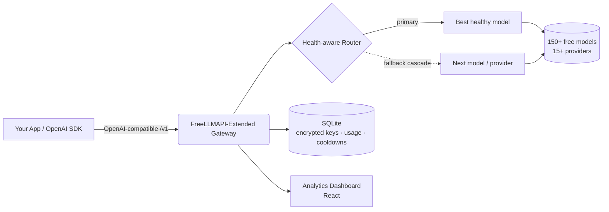
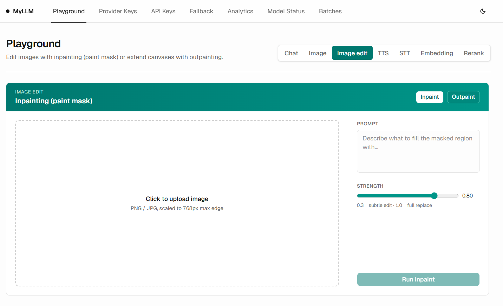
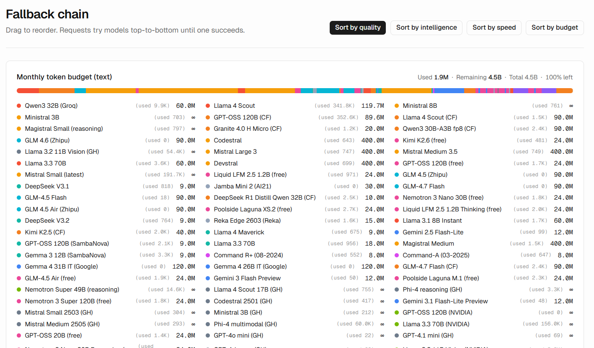

<div align="center">


# FreeLLMAPI-Extended

### Un único endpoint compatible con OpenAI frente a más de 150 LLM gratuitos — con enrutamiento consciente del estado de salud, conmutación por error automática y un panel de analíticas completo.

**Pasarela y agregador de LLM autoalojado y de código abierto.** Enruta chat, visión, generación de imágenes, embeddings, audio (STT/TTS) y reordenamiento (reranking) a más de 15 proveedores gratuitos a través de una sola API compatible con OpenAI — con conmutación por error inteligente para que tu aplicación nunca se caiga cuando un proveedor aplica límites de tasa.

[](LICENSE)
[](https://www.typescriptlang.org/)
[](#-uso-de-la-api)
[](#-proveedores-compatibles)
[](#-proveedores-compatibles)
[](#-características)

**🌍 Léelo en tu idioma:**
[English](README.md) ·
[Türkçe](README.tr.md) ·
[中文](README.zh.md) ·
[日本語](README.ja.md) ·
[한국어](README.ko.md) ·
[Español](README.es.md) ·
[Português](README.pt.md) ·
[Русский](README.ru.md)

</div>

---

## 📖 ¿Qué es FreeLLMAPI-Extended?

**FreeLLMAPI-Extended es una pasarela de API de LLM gratuita y autoalojada.** Expone un único endpoint REST compatible con OpenAI y enruta de forma transparente cada solicitud al mejor modelo gratuito disponible entre más de 15 proveedores (Google Gemini, Groq, Cerebras, Cloudflare Workers AI, Mistral, OpenRouter, GitHub Models, Cohere, SambaNova, NVIDIA NIM, Z.ai y más).

Cuando un proveedor aplica límites de tasa, devuelve errores o se cae, la pasarela **escala automáticamente al siguiente modelo saludable** — tu aplicación sigue funcionando sin ningún cambio de código. Apunta cualquier SDK de OpenAI a la URL de tu pasarela y obtendrás al instante inferencia gratuita, multiproveedor y tolerante a fallos.

> Reemplazo directo de la API de OpenAI. Cambia una sola URL base — conserva tu código existente.

---

## ✨ Características

| Capacidad | Lo que obtienes |
|---|---|
| 🔌 **Compatible con OpenAI** | `/v1/chat/completions`, `/v1/embeddings`, `/v1/images/generations`, `/v1/audio/{speech,transcriptions}`, `/v1/rerank`, `/v1/batches`. Funciona sin cambios con los SDK oficiales de OpenAI para Python/Node. |
| 🧠 **Enrutamiento automático consciente del estado de salud** | Los modelos se clasifican según su tasa de éxito **medida** + latencia (no solo por especificaciones estáticas), de modo que el modelo fiable más rápido encabeza la lista. Los modelos muertos/lentos descienden automáticamente. |
| 🔁 **Cascada de conmutación por error automática** | Conmutación por error por solicitud entre modelos y proveedores, con tiempos de espera (cooldowns) adaptativos (clases por minuto / por día / ruta muerta). La caída de un proveedor nunca hace fallar una solicitud. |
| 👁️ **Visión (multimodal)** | Envía imágenes junto con tus prompts. El enrutamiento consciente de visión elige automáticamente un modelo con capacidad de visión. |
| 🎨 **Generación y edición de imágenes** | Texto a imagen, imagen a imagen, inpainting y outpainting (FLUX, SDXL, CogView, Pollinations y más). |
| 🔢 **Embeddings y reordenamiento** | Embeddings multiproveedor (BGE-M3, Gemini, Cohere, Mistral) + reordenamiento de Cohere para pipelines RAG. |
| 🔊 **Audio** | Voz a texto (Whisper) y texto a voz en una sola API. |
| 📦 **API de lotes (Batch)** | Procesamiento por lotes asíncrono al estilo de OpenAI con webhooks (firmados con HMAC), reintentos y resultados en NDJSON. |
| 🧩 **Salida estructurada y herramientas** | Modo JSON, esquema JSON, llamadas a funciones/herramientas y streaming (SSE). |
| 🗝️ **Proveedores sin clave** | Algunos proveedores (Pollinations, Kilo) funcionan **sin ninguna clave de API** — capacidad de desbordamiento gratuita lista para usar. |
| 👥 **Claves por proyecto + control de gasto** | Emite claves de API con nombre por proyecto, rastrea el uso por clave e impón límites de gasto diarios/semanales/mensuales por usuario final. |
| 📊 **Panel de analíticas** | Volumen de solicitudes en tiempo real, tasa de éxito, latencia, uso de tokens, estimaciones de costos, reintentos en cascada y desgloses por clave. |
| 🔐 **Almacenamiento cifrado de claves** | Las claves de los proveedores se cifran en reposo con AES-256-GCM. |
| 🤖 **Alias de modelos** | Cadenas fijas y a prueba de reordenamiento (p. ej. un alias `coding` para agentes de programación) para un enrutamiento determinista. |
| 🩺 **Sonda de salud diaria** | Un trabajo programado sondea cada modelo y compara los catálogos upstream, de modo que los modelos muertos se detectan antes de que tus usuarios los encuentren. |
| 🧰 **Servidor MCP incluido** | Un servidor Model Context Protocol para que los clientes MCP puedan usar la pasarela directamente. |

**6 modalidades · más de 15 proveedores · más de 150 modelos gratuitos · 1 endpoint.**

---

## 🏗️ Arquitectura



- **Backend:** Node.js + TypeScript + Express, `better-sqlite3` (sin base de datos externa).
- **Frontend:** panel de React para analíticas y gestión de claves.
- **Almacenamiento:** SQLite — las claves de los proveedores se cifran con AES-256-GCM.
- **Enrutamiento:** cascada por solicitud con tiempos de espera (cooldowns) persistentes y clasificados (sobreviven a los reinicios).

---

## 🚀 Inicio rápido

```bash
# 1. Clone
git clone https://github.com/SeyhmusKaya/freellmapi-extended.git
cd freellmapi-extended

# 2. Install
npm install

# 3. Configure
cp .env.example .env
# Generate an encryption key:
node -e "console.log(require('crypto').randomBytes(32).toString('hex'))"
# Paste it into .env as ENCRYPTION_KEY=...

# 4. Run (server + dashboard)
npm run dev
```

Abre el panel, agrega una clave de proveedor gratuito (o usa proveedores sin clave) y estarás en marcha. Consulta [`.env.example`](.env.example) para conocer todas las opciones de configuración.

---

## 🔌 Uso de la API

Apunta **cualquier** SDK de OpenAI a tu pasarela. Deja vacío el campo `model` para enrutar automáticamente al mejor modelo disponible.

### Python (SDK de OpenAI)

```python
from openai import OpenAI

client = OpenAI(
    base_url="http://localhost:3001/v1",   # your gateway
    api_key="YOUR_GATEWAY_KEY",
)

resp = client.chat.completions.create(
    model="",  # empty = auto-route across all free providers
    messages=[{"role": "user", "content": "Explain quantum computing in one sentence."}],
)
print(resp.choices[0].message.content)
```

### cURL

```bash
curl http://localhost:3001/v1/chat/completions \
  -H "Authorization: Bearer YOUR_GATEWAY_KEY" \
  -H "Content-Type: application/json" \
  -d '{"messages":[{"role":"user","content":"Hello!"}]}'
```

### Visión (imagen + texto)

```json
{
  "messages": [{
    "role": "user",
    "content": [
      {"type": "text", "text": "What is in this image?"},
      {"type": "image_url", "image_url": {"url": "data:image/jpeg;base64,..."}}
    ]
  }]
}
```

Las cabeceras de respuesta exponen la decisión de enrutamiento: `X-Routed-Via: groq/llama-4-scout` y `X-Fallback-Attempts: 0`.

---

## 🧠 Enrutamiento inteligente

Lo que diferencia a FreeLLMAPI-Extended de un proxy sencillo:

- **Salud medida, no suposiciones.** La cadena de conmutación por error se reclasifica continuamente a partir de la tasa de éxito real de 7 días y la latencia de cada modelo. Un modelo que empieza a fallar desciende automáticamente; uno rápido y fiable asciende.
- **Tiempos de espera clasificados.** Los errores se agrupan (límite de tasa por minuto, cuota por día, ruta muerta, clave inválida) y a cada uno se le asigna el tiempo de espera adecuado — una cuota diaria espera hasta la medianoche UTC, una ráfaga transitoria espera segundos.
- **Cascada ante todo.** 404 / 429 / 5xx / tiempo de espera agotado / errores 400 específicos del proveedor activan un salto y continuación al siguiente modelo, de modo que un único endpoint problemático nunca hunde una solicitud.
- **Desbordamiento sin clave.** Los proveedores anónimos actúan como capacidad de último recurso, de modo que sigues atendiendo incluso cuando todos los proveedores con clave están limitados por tasa.
- **Límites de gasto por usuario final.** Atribuye el costo a tus propios usuarios finales y limita el gasto diario/semanal/mensual.

---

## 🌐 Proveedores compatibles

Chat de texto, visión, generación de imágenes, embeddings, audio (STT/TTS) y reordenamiento a través de:

**Google Gemini · Groq · Cerebras · Cloudflare Workers AI · Mistral · OpenRouter · GitHub Models · Cohere · SambaNova · NVIDIA NIM · Z.ai (Zhipu) · Pollinations (sin clave) · Kilo Gateway (sin clave) · AI21 · Reka** — y una vía sencilla para añadir cualquier proveedor compatible con OpenAI.

> Los límites de los planes gratuitos, las listas de modelos y las notas por proveedor están documentados en [`docs/FREE-PROVIDERS-RESEARCH.md`](docs/FREE-PROVIDERS-RESEARCH.md).

---

## 📊 Panel

Un panel de React integrado para claves, enrutamiento y analíticas:

- **Analíticas** — volumen de solicitudes, tasa de éxito real, latencia, uso de tokens, estimaciones de costos, reintentos en cascada, desglose por clave de API.
- **Claves** — agrega/rota/desactiva claves de proveedores (cifradas en reposo) y emite claves de consumidor por proyecto.
- **Conmutación por error (Fallback)** — visualiza y reordena la cadena de enrutamiento, o ordénala según la calidad medida.
- **Playground** — prueba los modelos directamente desde el navegador.

<p align="center">
  
  
</p>
<p align="center">
  
</p>

---

## 📚 Documentación

| Documento | Descripción |
|---|---|
| [`docs/FREE-PROVIDERS-RESEARCH.md`](docs/FREE-PROVIDERS-RESEARCH.md) | Matriz completa de proveedores/modelos, límites de planes gratuitos, registro de cambios |
| [`docs/BATCH-API.md`](docs/BATCH-API.md) | Guía del consumidor de la API de lotes (Batch) asíncrona |
| [`docs/IMAGE-GEN-PLAN.md`](docs/IMAGE-GEN-PLAN.md) | Generación y edición de imágenes |
| [`docs/VISION-PLAN.md`](docs/VISION-PLAN.md) | Visión / multimodal |
| [`docs/STRUCTURED-OUTPUT-PLAN.md`](docs/STRUCTURED-OUTPUT-PLAN.md) | Modo JSON y salida estructurada |
| [`mcp/README.md`](mcp/README.md) | Servidor Model Context Protocol |

---

## ❓ Preguntas frecuentes

**¿Es realmente gratis?**
Sí — agrega los planes gratuitos de muchos proveedores. Tú aportas claves de API gratuitas (o usas proveedores sin clave). La pasarela en sí tiene licencia MIT y es autoalojada.

**¿Es compatible con OpenAI?**
Sí. Implementa los formatos de Chat Completions, Embeddings, Images, Audio y Batch de OpenAI. La mayoría de las aplicaciones solo necesitan cambiar la URL base.

**¿Qué ocurre cuando un proveedor está limitado por tasa o caído?**
La solicitud escala automáticamente al siguiente modelo/proveedor saludable. Quien hace la llamada nunca ve el fallo — solo una cabecera `X-Routed-Via` ligeramente distinta.

**¿Necesito un servidor de base de datos?**
No. Usa SQLite embebido (`better-sqlite3`). Las claves de los proveedores se cifran con AES-256-GCM.

**¿Puedo añadir mi propio proveedor?**
Sí — cualquier endpoint compatible con OpenAI puede registrarse con una URL base.

**¿En qué se diferencia esto de un proxy simple?**
Reclasificación consciente del estado de salud, tiempos de espera adaptativos clasificados, cascada por solicitud, desbordamiento sin clave, procesamiento por lotes, límites de gasto por usuario final y un panel de analíticas completo.

---

## 🙏 Créditos y atribución

FreeLLMAPI-Extended está construido **sobre e inspirado en** el excelente trabajo de código abierto de
**[tashfeenahmed/freellmapi](https://github.com/tashfeenahmed/freellmapi)** de [@tashfeenahmed](https://github.com/tashfeenahmed) — un enorme agradecimiento por la base original. Este proyecto lo amplía con modalidades adicionales, enrutamiento consciente del estado de salud, procesamiento por lotes, facturación por usuario final, proveedores sin clave y un panel de analíticas rediseñado.

Con licencia **MIT** (igual que el upstream) — consulta [LICENSE](LICENSE).

---

## 🤝 Contribuciones

Las incidencias (issues) y las pull requests son bienvenidas. Ya sea un nuevo proveedor gratuito, una mejora de enrutamiento, una corrección de errores o documentación — las contribuciones de cualquier tamaño ayudan.

---

<div align="center">

**FreeLLMAPI-Extended** — pasarela de LLM gratuita compatible con OpenAI · agregador de API de IA multiproveedor · enrutador de LLM autoalojado con conmutación por error automática.

⭐ Si este proyecto te resulta útil, márcalo con una estrella para apoyar su desarrollo.

<sub>Palabras clave: API de LLM gratuita, pasarela compatible con OpenAI, agregador de LLM, enrutador de IA multiproveedor, alternativa gratuita a la API de GPT, pasarela de IA autoalojada, conmutación por error de LLM, API gratuita de Gemini Groq Cerebras Cloudflare, proxy de IA, API de embeddings gratuita, API de generación de imágenes gratuita.</sub>

</div>
