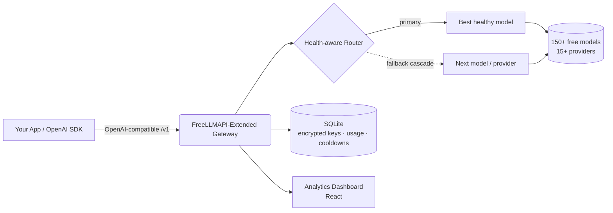

<div align="center">

# FreeLLMAPI-Extended

### 150以上の無料LLMの前段に立つ、OpenAI互換のひとつのエンドポイント — ヘルスを考慮したルーティング、自動フォールバック、そして完全な分析ダッシュボードを備える。

**セルフホスト型・オープンソースのLLMゲートウェイ兼アグリゲーター。** チャット、ビジョン、画像生成、埋め込み、音声（STT/TTS）、リランキングを、単一のOpenAI互換APIを通じて15以上の無料プロバイダーへルーティング — インテリジェントなフェイルオーバーにより、あるプロバイダーがレート制限に達してもアプリが停止することはありません。

[](LICENSE)
[](https://www.typescriptlang.org/)
[](#-api-usage)
[](#-supported-providers)
[](#-supported-providers)
[](#-features)

**🌍 お好みの言語で読む:**
[English](README.md) ·
[Türkçe](README.tr.md) ·
[中文](README.zh.md) ·
[日本語](README.ja.md) ·
[한국어](README.ko.md) ·
[Español](README.es.md) ·
[Português](README.pt.md) ·
[Русский](README.ru.md)

</div>

---

## 📖 FreeLLMAPI-Extended とは？

**FreeLLMAPI-Extended は、無料でセルフホスト可能なLLM APIゲートウェイです。** 単一のOpenAI互換RESTエンドポイントを公開し、すべてのリクエストを15以上のプロバイダー（Google Gemini、Groq、Cerebras、Cloudflare Workers AI、Mistral、OpenRouter、GitHub Models、Cohere、SambaNova、NVIDIA NIM、Z.ai など）にまたがる、その時点で最適な無料モデルへ透過的にルーティングします。

あるプロバイダーがレート制限に達したり、エラーを返したり、ダウンしたりすると、ゲートウェイは**自動的に次の健全なモデルへとカスケードします** — コードを一切変更することなく、アプリケーションは動作し続けます。任意のOpenAI SDKをあなたのゲートウェイURLに向けるだけで、無料・マルチプロバイダー・耐障害性を備えた推論が即座に手に入ります。

> OpenAI APIのドロップイン置き換え。ベースURLをひとつ変えるだけ — 既存のコードはそのまま。

---

## ✨ 特長

| 機能 | 得られるもの |
|---|---|
| 🔌 **OpenAI互換** | `/v1/chat/completions`、`/v1/embeddings`、`/v1/images/generations`、`/v1/audio/{speech,transcriptions}`、`/v1/rerank`、`/v1/batches`。公式のOpenAI Python/Node SDKをそのまま利用できます。 |
| 🧠 **ヘルス考慮の自動ルーティング** | モデルは（静的なスペックだけでなく）**実測**の成功率とレイテンシでランク付けされるため、最速かつ信頼性の高いモデルが先頭に立ちます。動作しない・遅いモデルは自動的に沈みます。 |
| 🔁 **自動フォールバックカスケード** | モデルとプロバイダーをまたいだリクエスト単位のフェイルオーバー。適応型クールダウン（分単位 / 日単位 / 廃止ルートの分類）付き。あるプロバイダーがダウンしてもリクエストが失敗することはありません。 |
| 👁️ **ビジョン（マルチモーダル）** | プロンプトと一緒に画像を送信できます。ビジョン対応のルーティングが、ビジョン対応モデルを自動で選択します。 |
| 🎨 **画像生成・編集** | テキストから画像、画像から画像、インペインティング、アウトペインティング（FLUX、SDXL、CogView、Pollinations など）。 |
| 🔢 **埋め込み・リランキング** | マルチプロバイダーの埋め込み（BGE-M3、Gemini、Cohere、Mistral）＋ RAGパイプライン向けのCohereリランキング。 |
| 🔊 **音声** | 音声認識（Whisper）と音声合成をひとつのAPIで。 |
| 📦 **Batch API** | Webhook（HMAC署名付き）、リトライ、NDJSON結果を備えた、OpenAIスタイルの非同期バッチ処理。 |
| 🧩 **構造化出力・ツール** | JSONモード、JSONスキーマ、関数/ツール呼び出し、ストリーミング（SSE）。 |
| 🗝️ **キーレスプロバイダー** | 一部のプロバイダー（Pollinations、Kilo）は**APIキーがまったく不要**で動作します — 追加の無料オーバーフロー容量をそのまま利用できます。 |
| 👥 **プロジェクト単位のキー＋支出管理** | プロジェクトごとに名前付きAPIキーを発行し、キー単位で使用量を追跡、エンドユーザー単位で日次/週次/月次の支出上限を適用できます。 |
| 📊 **分析ダッシュボード** | リクエスト量、成功率、レイテンシ、トークン使用量、コスト見積もり、カスケードリトライ、キー単位の内訳をリアルタイムで表示。 |
| 🔐 **暗号化されたキー保管** | プロバイダーキーはAES-256-GCMで保管時に暗号化されます。 |
| 🤖 **モデルエイリアス** | 決定論的なルーティングのための、固定・並べ替え不可のチェーン（例: コーディングエージェント向けの `coding` エイリアス）。 |
| 🩺 **日次ヘルスプローブ** | スケジュールされたジョブがすべてのモデルをプローブし、上流のカタログとの差分を取るため、ユーザーが遭遇する前に動作しないモデルを検出します。 |
| 🧰 **MCPサーバー同梱** | Model Context Protocol サーバーを同梱し、MCPクライアントがゲートウェイを直接利用できます。 |

**6つのモダリティ · 15以上のプロバイダー · 150以上の無料モデル · 1つのエンドポイント。**

---

## 🏗️ アーキテクチャ



- **バックエンド:** Node.js + TypeScript + Express、`better-sqlite3`（外部DB不要）。
- **フロントエンド:** React製の分析・キー管理ダッシュボード。
- **ストレージ:** SQLite — プロバイダーキーはAES-256-GCMで暗号化。
- **ルーティング:** 永続的かつ分類されたクールダウンを伴うリクエスト単位のカスケード（再起動後も維持）。

---

## 🚀 クイックスタート

```bash
# 1. Clone
git clone https://github.com/SeyhmusKaya/freellmapi-extended.git
cd freellmapi-extended

# 2. Install
npm install

# 3. Configure
cp .env.example .env
# Generate an encryption key:
node -e "console.log(require('crypto').randomBytes(32).toString('hex'))"
# Paste it into .env as ENCRYPTION_KEY=...

# 4. Run (server + dashboard)
npm run dev
```

ダッシュボードを開き、無料のプロバイダーキーを追加（またはキーレスプロバイダーを利用）すれば、すぐに稼働します。すべての設定オプションは [`.env.example`](.env.example) を参照してください。

---

## 🔌 API の使い方

**任意の** OpenAI SDK をあなたのゲートウェイに向けます。`model` フィールドを空のままにすると、その時点で最適なモデルへ自動ルーティングされます。

### Python（OpenAI SDK）

```python
from openai import OpenAI

client = OpenAI(
    base_url="http://localhost:3001/v1",   # your gateway
    api_key="YOUR_GATEWAY_KEY",
)

resp = client.chat.completions.create(
    model="",  # empty = auto-route across all free providers
    messages=[{"role": "user", "content": "Explain quantum computing in one sentence."}],
)
print(resp.choices[0].message.content)
```

### cURL

```bash
curl http://localhost:3001/v1/chat/completions \
  -H "Authorization: Bearer YOUR_GATEWAY_KEY" \
  -H "Content-Type: application/json" \
  -d '{"messages":[{"role":"user","content":"Hello!"}]}'
```

### ビジョン（画像 + テキスト）

```json
{
  "messages": [{
    "role": "user",
    "content": [
      {"type": "text", "text": "What is in this image?"},
      {"type": "image_url", "image_url": {"url": "data:image/jpeg;base64,..."}}
    ]
  }]
}
```

レスポンスヘッダーがルーティングの判断を公開します: `X-Routed-Via: groq/llama-4-scout` と `X-Fallback-Attempts: 0`。

---

## 🧠 インテリジェントなルーティング

単なるプロキシと FreeLLMAPI-Extended が異なる点:

- **推測ではなく実測のヘルス。** フォールバックチェーンは、各モデルの実際の7日間の成功率とレイテンシから継続的に再ランク付けされます。失敗し始めたモデルは自動的に沈み、高速で信頼性の高いモデルが浮上します。
- **分類されたクールダウン。** エラーはバケットに分類され（分単位のレート制限、日単位のクォータ、廃止ルート、無効なキー）、それぞれに適切なクールダウンが割り当てられます — 日次クォータはUTCの深夜まで待機し、一時的なバーストは数秒待機します。
- **あらゆるケースでのカスケード。** 404 / 429 / 5xx / タイムアウト / プロバイダー固有の400 は、いずれもスキップして次のモデルへ進む動作を引き起こすため、ひとつの癖のあるエンドポイントがリクエストを台無しにすることはありません。
- **キーレスのオーバーフロー。** 匿名プロバイダーが最後の手段の容量として機能するため、キー付きのすべてのプロバイダーがレート制限に達しても提供を続けられます。
- **エンドユーザー単位の支出上限。** コストをあなた自身のエンドユーザーに割り当て、日次/週次/月次の支出に上限を設けられます。

---

## 🌐 対応プロバイダー

テキストチャット、ビジョン、画像生成、埋め込み、音声（STT/TTS）、リランキングを、以下にまたがって提供:

**Google Gemini · Groq · Cerebras · Cloudflare Workers AI · Mistral · OpenRouter · GitHub Models · Cohere · SambaNova · NVIDIA NIM · Z.ai (Zhipu) · Pollinations (キーレス) · Kilo Gateway (キーレス) · AI21 · Reka** — さらに、任意のOpenAI互換プロバイダーを簡単に追加できる仕組み。

> 無料枠の制限、モデル一覧、プロバイダーごとの注意事項は [`docs/FREE-PROVIDERS-RESEARCH.md`](docs/FREE-PROVIDERS-RESEARCH.md) に記載されています。

---

## 📊 ダッシュボード

キー、ルーティング、分析のための組み込みReactダッシュボード:

- **Analytics** — リクエスト量、実測の成功率、レイテンシ、トークン使用量、コスト見積もり、カスケードリトライ、APIキー単位の内訳。
- **Keys** — プロバイダーキーの追加/ローテーション/無効化（保管時に暗号化）と、プロジェクト単位のコンシューマーキーの発行。
- **Fallback** — ルーティングチェーンの表示と並べ替え、または実測品質による並べ替え。
- **Playground** — ブラウザから直接モデルをテスト。

<!-- Screenshots: place dashboard images in /repo-assets and reference them here. -->
<!--  -->

---

## 📚 ドキュメント

| ドキュメント | 説明 |
|---|---|
| [`docs/FREE-PROVIDERS-RESEARCH.md`](docs/FREE-PROVIDERS-RESEARCH.md) | プロバイダー/モデルの完全なマトリクス、無料枠の制限、変更履歴 |
| [`docs/BATCH-API.md`](docs/BATCH-API.md) | 非同期 Batch API コンシューマーガイド |
| [`docs/IMAGE-GEN-PLAN.md`](docs/IMAGE-GEN-PLAN.md) | 画像生成・編集 |
| [`docs/VISION-PLAN.md`](docs/VISION-PLAN.md) | ビジョン / マルチモーダル |
| [`docs/STRUCTURED-OUTPUT-PLAN.md`](docs/STRUCTURED-OUTPUT-PLAN.md) | JSONモード・構造化出力 |
| [`mcp/README.md`](mcp/README.md) | Model Context Protocol サーバー |

---

## ❓ よくある質問（FAQ）

**本当に無料ですか？**
はい — 多くのプロバイダーの無料枠を集約しています。あなたは無料のAPIキーを用意する（またはキーレスプロバイダーを利用する）だけです。ゲートウェイ自体はMITライセンスでセルフホスト可能です。

**OpenAI互換ですか？**
はい。OpenAIのChat Completions、Embeddings、Images、Audio、Batchの形式を実装しています。ほとんどのアプリはベースURLを変更するだけで済みます。

**プロバイダーがレート制限に達したり、ダウンしたりするとどうなりますか？**
リクエストは自動的に次の健全なモデル/プロバイダーへとカスケードします。呼び出し側に失敗が見えることはなく、わずかに異なる `X-Routed-Via` ヘッダーが返るだけです。

**データベースサーバーは必要ですか？**
いいえ。組み込みのSQLite（`better-sqlite3`）を使用します。プロバイダーキーはAES-256-GCMで暗号化されます。

**自分のプロバイダーを追加できますか？**
はい — 任意のOpenAI互換エンドポイントをベースURLで登録できます。

**単なるプロキシと何が違うのですか？**
ヘルスを考慮した再ランク付け、分類された適応型クールダウン、リクエスト単位のカスケード、キーレスのオーバーフロー、バッチ処理、エンドユーザー単位の支出上限、そして完全な分析ダッシュボードです。

---

## 🙏 クレジットと謝辞

FreeLLMAPI-Extended は、[@tashfeenahmed](https://github.com/tashfeenahmed) による優れたオープンソースの成果である **[tashfeenahmed/freellmapi](https://github.com/tashfeenahmed/freellmapi)** **を土台とし、それに着想を得て**構築されています — 元となった基盤に心より感謝します。本プロジェクトは、追加のモダリティ、ヘルスを考慮したルーティング、バッチ処理、エンドユーザー単位の課金、キーレスプロバイダー、そして再設計された分析ダッシュボードによって、それを拡張しています。

**MIT** ライセンス（上流と同じ）の下で提供されます — [LICENSE](LICENSE) を参照してください。

---

## 🤝 コントリビューション

Issue とプルリクエストを歓迎します。新しい無料プロバイダー、ルーティングの改善、バグ修正、ドキュメントのいずれであっても — どんな規模の貢献も役立ちます。

---

<div align="center">

**FreeLLMAPI-Extended** — 無料のOpenAI互換LLMゲートウェイ · マルチプロバイダーAI APIアグリゲーター · 自動フォールバックを備えたセルフホスト型LLMルーター。

⭐ このプロジェクトがお役に立てば、開発を応援するためにスターを付けてください。

<sub>キーワード: 無料 LLM API, OpenAI互換ゲートウェイ, LLMアグリゲーター, マルチプロバイダーAIルーター, 無料 GPT API 代替, セルフホスト型AIゲートウェイ, LLMフォールバック, Gemini Groq Cerebras Cloudflare 無料API, AIプロキシ, 無料埋め込みAPI, 無料画像生成API。</sub>

</div>
