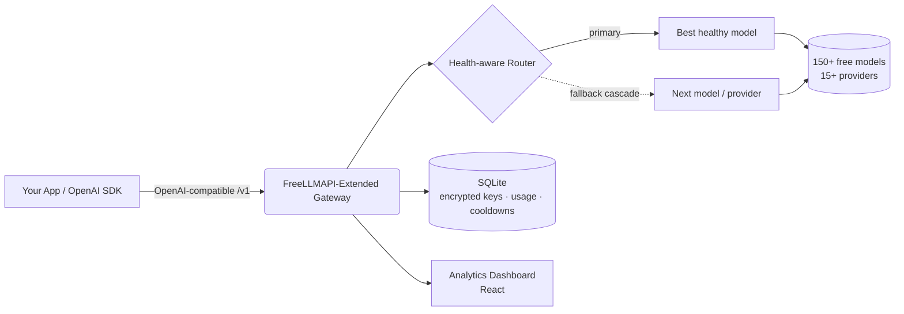

<div align="center">


# FreeLLMAPI-Extended

### 150개 이상의 무료 LLM 앞단에 놓인 단일 OpenAI 호환 엔드포인트 — 상태 인식 라우팅, 자동 폴백, 그리고 완전한 분석 대시보드를 갖춘.

**셀프 호스팅, 오픈소스 LLM 게이트웨이 & 애그리게이터.** 채팅, 비전, 이미지 생성, 임베딩, 오디오(STT/TTS), 리랭킹을 단일 OpenAI 호환 API를 통해 15개 이상의 무료 제공자로 라우팅합니다 — 한 제공자가 속도 제한에 걸려도 앱이 절대 멈추지 않도록 지능형 장애 복구를 제공합니다.

[](LICENSE)
[](https://www.typescriptlang.org/)
[](#-api-usage)
[](#-supported-providers)
[](#-supported-providers)
[](#-features)

**🌍 원하는 언어로 읽기:**
[English](README.md) ·
[Türkçe](README.tr.md) ·
[中文](README.zh.md) ·
[日本語](README.ja.md) ·
[한국어](README.ko.md) ·
[Español](README.es.md) ·
[Português](README.pt.md) ·
[Русский](README.ru.md)

</div>

---

## 📖 FreeLLMAPI-Extended란?

**FreeLLMAPI-Extended는 무료로 사용할 수 있는 셀프 호스팅 LLM API 게이트웨이입니다.** 단일 OpenAI 호환 REST 엔드포인트를 노출하고, 모든 요청을 15개 이상의 제공자(Google Gemini, Groq, Cerebras, Cloudflare Workers AI, Mistral, OpenRouter, GitHub Models, Cohere, SambaNova, NVIDIA NIM, Z.ai 등)에 걸쳐 사용 가능한 최적의 무료 모델로 투명하게 라우팅합니다.

한 제공자가 속도 제한에 걸리거나 오류를 내거나 다운되면, 게이트웨이는 **자동으로 다음 정상 모델로 단계적 전환(cascade)** 합니다 — 코드를 한 줄도 바꾸지 않아도 애플리케이션은 계속 동작합니다. 어떤 OpenAI SDK든 게이트웨이 URL을 가리키도록 설정하기만 하면, 무료이면서 멀티 제공자 기반의 장애 내성을 갖춘 추론을 즉시 사용할 수 있습니다.

> OpenAI API의 드롭인 대체재. 베이스 URL 하나만 바꾸면 기존 코드를 그대로 유지할 수 있습니다.

---

## ✨ 기능

| 기능 | 제공 내용 |
|---|---|
| 🔌 **OpenAI 호환** | `/v1/chat/completions`, `/v1/embeddings`, `/v1/images/generations`, `/v1/audio/{speech,transcriptions}`, `/v1/rerank`, `/v1/batches`. 공식 OpenAI Python/Node SDK를 수정 없이 그대로 사용할 수 있습니다. |
| 🧠 **상태 인식 자동 라우팅** | 모델은 정적 사양이 아니라 **실측** 성공률 + 지연 시간을 기준으로 순위가 매겨지므로, 가장 빠르고 안정적인 모델이 선두에 섭니다. 죽었거나 느린 모델은 자동으로 가라앉습니다. |
| 🔁 **자동 폴백 단계적 전환** | 요청 단위로 모델 및 제공자 전반에 걸쳐 장애 복구하며, 적응형 쿨다운(분 / 일 / 죽은 경로 등급)을 적용합니다. 한 제공자가 다운돼도 요청이 실패하는 일이 없습니다. |
| 👁️ **비전(멀티모달)** | 프롬프트와 함께 이미지를 전송하세요. 비전 인식 라우팅이 비전 지원 모델을 자동으로 선택합니다. |
| 🎨 **이미지 생성 및 편집** | 텍스트-투-이미지, 이미지-투-이미지, 인페인팅, 아웃페인팅(FLUX, SDXL, CogView, Pollinations 등). |
| 🔢 **임베딩 & 리랭킹** | 멀티 제공자 임베딩(BGE-M3, Gemini, Cohere, Mistral) + RAG 파이프라인을 위한 Cohere 리랭킹. |
| 🔊 **오디오** | 음성-투-텍스트(Whisper)와 텍스트-투-스피치를 하나의 API에서. |
| 📦 **배치 API** | 웹훅(HMAC 서명), 재시도, NDJSON 결과를 지원하는 OpenAI 스타일 비동기 배치 처리. |
| 🧩 **구조화된 출력 & 도구** | JSON 모드, JSON 스키마, 함수/도구 호출, 그리고 스트리밍(SSE). |
| 🗝️ **키 없는 제공자** | 일부 제공자(Pollinations, Kilo)는 **API 키 없이도** 동작합니다 — 별도 설정 없이 즉시 사용할 수 있는 무료 여유 용량입니다. |
| 👥 **프로젝트별 키 + 지출 제어** | 프로젝트마다 이름이 지정된 API 키를 발급하고, 키별 사용량을 추적하며, 최종 사용자별 일간/주간/월간 지출 한도를 강제할 수 있습니다. |
| 📊 **분석 대시보드** | 실시간 요청량, 성공률, 지연 시간, 토큰 사용량, 비용 추정, 단계적 재시도, 키별 분석. |
| 🔐 **암호화된 키 저장소** | 제공자 키는 AES-256-GCM으로 저장 시 암호화됩니다. |
| 🤖 **모델 별칭** | 결정론적 라우팅을 위한 고정되고 순서가 변하지 않는 체인(예: 코딩 에이전트를 위한 `coding` 별칭). |
| 🩺 **일일 상태 점검 프로브** | 예약된 작업이 모든 모델을 점검하고 업스트림 카탈로그 차이를 비교하므로, 사용자가 부딪히기 전에 죽은 모델을 잡아냅니다. |
| 🧰 **MCP 서버 포함** | MCP 클라이언트가 게이트웨이를 직접 사용할 수 있도록 하는 Model Context Protocol 서버. |

**6가지 모달리티 · 15개 이상의 제공자 · 150개 이상의 무료 모델 · 1개의 엔드포인트.**

---

## 🏗️ 아키텍처



- **백엔드:** Node.js + TypeScript + Express, `better-sqlite3`(외부 DB 불필요).
- **프론트엔드:** React 기반 분석 및 키 관리 대시보드.
- **저장소:** SQLite — 제공자 키는 AES-256-GCM으로 암호화됩니다.
- **라우팅:** 영속적이고 분류된 쿨다운을 갖춘 요청 단위 단계적 전환(재시작 후에도 유지됨).

---

## 🚀 빠른 시작

```bash
# 1. Clone
git clone https://github.com/SeyhmusKaya/freellmapi-extended.git
cd freellmapi-extended

# 2. Install
npm install

# 3. Configure
cp .env.example .env
# Generate an encryption key:
node -e "console.log(require('crypto').randomBytes(32).toString('hex'))"
# Paste it into .env as ENCRYPTION_KEY=...

# 4. Run (server + dashboard)
npm run dev
```

대시보드를 열고 무료 제공자 키를 추가하거나(또는 키 없는 제공자를 사용하면) 곧바로 동작합니다. 모든 설정 옵션은 [`.env.example`](.env.example)에서 확인하세요.

---

## 🔌 API 사용법

**어떤** OpenAI SDK든 게이트웨이를 가리키도록 설정하세요. `model` 필드를 비워 두면 사용 가능한 최적의 모델로 자동 라우팅됩니다.

### Python (OpenAI SDK)

```python
from openai import OpenAI

client = OpenAI(
    base_url="http://localhost:3001/v1",   # your gateway
    api_key="YOUR_GATEWAY_KEY",
)

resp = client.chat.completions.create(
    model="",  # empty = auto-route across all free providers
    messages=[{"role": "user", "content": "Explain quantum computing in one sentence."}],
)
print(resp.choices[0].message.content)
```

### cURL

```bash
curl http://localhost:3001/v1/chat/completions \
  -H "Authorization: Bearer YOUR_GATEWAY_KEY" \
  -H "Content-Type: application/json" \
  -d '{"messages":[{"role":"user","content":"Hello!"}]}'
```

### 비전(이미지 + 텍스트)

```json
{
  "messages": [{
    "role": "user",
    "content": [
      {"type": "text", "text": "What is in this image?"},
      {"type": "image_url", "image_url": {"url": "data:image/jpeg;base64,..."}}
    ]
  }]
}
```

응답 헤더는 라우팅 결정을 노출합니다: `X-Routed-Via: groq/llama-4-scout` 및 `X-Fallback-Attempts: 0`.

---

## 🧠 지능형 라우팅

FreeLLMAPI-Extended가 단순한 프록시와 다른 점:

- **추측이 아닌 실측 상태.** 폴백 체인은 각 모델의 실제 7일 성공률과 지연 시간을 바탕으로 지속적으로 재순위화됩니다. 실패하기 시작한 모델은 자동으로 가라앉고, 빠르고 안정적인 모델은 부상합니다.
- **분류된 쿨다운.** 오류는 등급으로 분류되며(분당 속도 제한, 일일 쿼터, 죽은 경로, 잘못된 키), 각각 적절한 쿨다운을 받습니다 — 일일 쿼터는 UTC 자정까지 대기하고, 일시적인 버스트는 몇 초만 대기합니다.
- **모든 상황에서의 단계적 전환.** 404 / 429 / 5xx / 타임아웃 / 제공자별 400 오류 모두 다음 모델로의 건너뛰고 계속(skip-and-continue)을 유발하므로, 별난 엔드포인트 하나가 요청을 무너뜨리는 일이 없습니다.
- **키 없는 여유 용량.** 익명 제공자는 최후의 수단 용량으로 작동하므로, 키가 있는 모든 제공자가 속도 제한에 걸려도 계속 서비스를 제공합니다.
- **최종 사용자별 지출 한도.** 비용을 자체 최종 사용자에게 귀속시키고 일간/주간/월간 지출을 제한할 수 있습니다.

---

## 🌐 지원 제공자

텍스트 채팅, 비전, 이미지 생성, 임베딩, 오디오(STT/TTS), 리랭킹을 다음 제공자 전반에서 지원합니다:

**Google Gemini · Groq · Cerebras · Cloudflare Workers AI · Mistral · OpenRouter · GitHub Models · Cohere · SambaNova · NVIDIA NIM · Z.ai (Zhipu) · Pollinations (키 없음) · Kilo Gateway (키 없음) · AI21 · Reka** — 그리고 OpenAI 호환 제공자라면 무엇이든 손쉽게 추가할 수 있는 경로를 제공합니다.

> 무료 등급 한도, 모델 목록, 제공자별 참고 사항은 [`docs/FREE-PROVIDERS-RESEARCH.md`](docs/FREE-PROVIDERS-RESEARCH.md)에 문서화되어 있습니다.

---

## 📊 대시보드

키, 라우팅, 분석을 위한 내장 React 대시보드:

- **Analytics** — 요청량, 실제 성공률, 지연 시간, 토큰 사용량, 비용 추정, 단계적 재시도, API 키별 분석.
- **Keys** — 제공자 키 추가/교체/비활성화(저장 시 암호화) 및 프로젝트별 컨슈머 키 발급.
- **Fallback** — 라우팅 체인을 보고 순서를 재배치하거나, 실측 품질 기준으로 정렬.
- **Playground** — 브라우저에서 직접 모델을 테스트.

<!-- Screenshots: place dashboard images in /repo-assets and reference them here. -->
<!--  -->

---

## 📚 문서

| 문서 | 설명 |
|---|---|
| [`docs/FREE-PROVIDERS-RESEARCH.md`](docs/FREE-PROVIDERS-RESEARCH.md) | 전체 제공자/모델 매트릭스, 무료 등급 한도, 변경 이력 |
| [`docs/BATCH-API.md`](docs/BATCH-API.md) | 비동기 배치 API 컨슈머 가이드 |
| [`docs/IMAGE-GEN-PLAN.md`](docs/IMAGE-GEN-PLAN.md) | 이미지 생성 및 편집 |
| [`docs/VISION-PLAN.md`](docs/VISION-PLAN.md) | 비전 / 멀티모달 |
| [`docs/STRUCTURED-OUTPUT-PLAN.md`](docs/STRUCTURED-OUTPUT-PLAN.md) | JSON 모드 및 구조화된 출력 |
| [`mcp/README.md`](mcp/README.md) | Model Context Protocol 서버 |

---

## ❓ 자주 묻는 질문(FAQ)

**정말 무료인가요?**
네 — 여러 제공자의 무료 등급을 집계합니다. 무료 API 키를 제공하거나(또는 키 없는 제공자를 사용) 하면 됩니다. 게이트웨이 자체는 MIT 라이선스이며 셀프 호스팅입니다.

**OpenAI 호환인가요?**
네. OpenAI의 Chat Completions, Embeddings, Images, Audio, Batch 형식을 구현합니다. 대부분의 앱은 베이스 URL만 바꾸면 됩니다.

**제공자가 속도 제한에 걸리거나 다운되면 어떻게 되나요?**
요청은 자동으로 다음 정상 모델/제공자로 단계적 전환됩니다. 호출자는 실패를 전혀 보지 못하며, 약간 다른 `X-Routed-Via` 헤더만 보게 됩니다.

**데이터베이스 서버가 필요한가요?**
아니요. 임베디드 SQLite(`better-sqlite3`)를 사용합니다. 제공자 키는 AES-256-GCM으로 암호화됩니다.

**제 자체 제공자를 추가할 수 있나요?**
네 — OpenAI 호환 엔드포인트라면 베이스 URL로 등록할 수 있습니다.

**일반 프록시와는 어떻게 다른가요?**
상태 인식 재순위화, 분류된 적응형 쿨다운, 요청 단위 단계적 전환, 키 없는 여유 용량, 배치 처리, 최종 사용자별 지출 한도, 그리고 완전한 분석 대시보드입니다.

---

## 🙏 크레딧 & 출처

FreeLLMAPI-Extended는 [@tashfeenahmed](https://github.com/tashfeenahmed)가 만든 훌륭한 오픈소스 작업물인
**[tashfeenahmed/freellmapi](https://github.com/tashfeenahmed/freellmapi)** **을(를) 기반으로 하며 그로부터 영감을 받아** 만들어졌습니다 — 원본 토대를 제공해 주셔서 진심으로 감사드립니다. 이 프로젝트는 추가 모달리티, 상태 인식 라우팅, 배치 처리, 최종 사용자별 과금, 키 없는 제공자, 그리고 새롭게 디자인된 분석 대시보드로 이를 확장합니다.

**MIT** 라이선스(업스트림과 동일)로 배포됩니다 — [LICENSE](LICENSE)를 참조하세요.

---

## 🤝 기여하기

이슈와 풀 리퀘스트를 환영합니다. 새로운 무료 제공자, 라우팅 개선, 버그 수정, 문서 등 — 크기에 관계없이 모든 기여가 도움이 됩니다.

---

<div align="center">

**FreeLLMAPI-Extended** — 무료 OpenAI 호환 LLM 게이트웨이 · 멀티 제공자 AI API 애그리게이터 · 자동 폴백을 갖춘 셀프 호스팅 LLM 라우터.

⭐ 이 프로젝트가 도움이 되었다면, 개발을 지원하기 위해 스타를 눌러 주세요.

<sub>키워드: 무료 LLM API, OpenAI 호환 게이트웨이, LLM 애그리게이터, 멀티 제공자 AI 라우터, 무료 GPT API 대안, 셀프 호스팅 AI 게이트웨이, LLM 폴백, Gemini Groq Cerebras Cloudflare 무료 API, AI 프록시, 무료 임베딩 API, 무료 이미지 생성 API.</sub>

</div>
