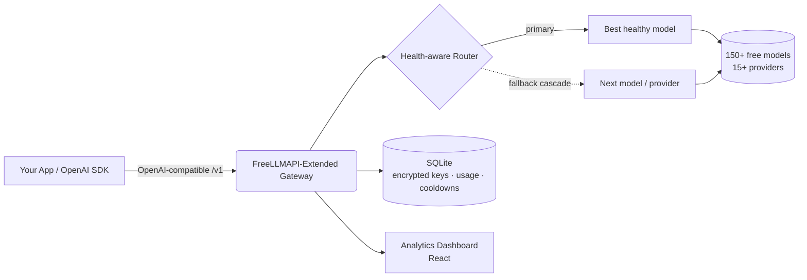

<div align="center">


# FreeLLMAPI-Extended

### One OpenAI-compatible endpoint in front of 150+ free LLMs — with health-aware routing, automatic fallback, and a full analytics dashboard.

**Self-hosted, open-source LLM gateway & aggregator.** Route chat, vision, image generation, embeddings, audio (STT/TTS), and reranking to 15+ free providers through a single OpenAI-compatible API — with intelligent failover so your app never goes down when one provider rate-limits.

[](LICENSE)
[](https://www.typescriptlang.org/)
[](#-api-usage)
[](#-supported-providers)
[](#-supported-providers)
[](#-features)

**🌍 Read this in your language:**
[English](README.md) ·
[Türkçe](README.tr.md) ·
[中文](README.zh.md) ·
[日本語](README.ja.md) ·
[한국어](README.ko.md) ·
[Español](README.es.md) ·
[Português](README.pt.md) ·
[Русский](README.ru.md)

</div>

---

## 📖 What is FreeLLMAPI-Extended?

**FreeLLMAPI-Extended is a free, self-hosted LLM API gateway.** It exposes a single OpenAI-compatible REST endpoint and transparently routes every request to the best available free model across 15+ providers (Google Gemini, Groq, Cerebras, Cloudflare Workers AI, Mistral, OpenRouter, GitHub Models, Cohere, SambaNova, NVIDIA NIM, Z.ai, and more).

When a provider rate-limits, errors, or goes down, the gateway **automatically cascades to the next healthy model** — your application keeps working with zero code changes. Point any OpenAI SDK at your gateway URL and you instantly get free, multi-provider, fault-tolerant inference.

> Drop-in replacement for the OpenAI API. Change one base URL — keep your existing code.

---

## ✨ Features

| Capability | What you get |
|---|---|
| 🔌 **OpenAI-compatible** | `/v1/chat/completions`, `/v1/embeddings`, `/v1/images/generations`, `/v1/audio/{speech,transcriptions}`, `/v1/rerank`, `/v1/batches`. Works with the official OpenAI Python/Node SDKs unchanged. |
| 🧠 **Health-aware auto-routing** | Models are ranked by **measured** success rate + latency (not just static specs), so the fastest reliable model leads. Dead/slow models sink automatically. |
| 🔁 **Automatic fallback cascade** | Per-request failover across models and providers, with adaptive cooldowns (minute / day / dead-route classes). One provider going down never fails a request. |
| 👁️ **Vision (multimodal)** | Send images with your prompts. Vision-aware routing picks a vision-capable model automatically. |
| 🎨 **Image generation & editing** | Text-to-image, image-to-image, inpainting, outpainting (FLUX, SDXL, CogView, Pollinations, and more). |
| 🔢 **Embeddings & Reranking** | Multi-provider embeddings (BGE-M3, Gemini, Cohere, Mistral) + Cohere reranking for RAG pipelines. |
| 🔊 **Audio** | Speech-to-text (Whisper) and text-to-speech in one API. |
| 📦 **Batch API** | OpenAI-style async batch processing with webhooks (HMAC-signed), retries, and NDJSON results. |
| 🧩 **Structured output & tools** | JSON mode, JSON schema, function/tool calling, and streaming (SSE). |
| 🗝️ **Keyless providers** | Some providers (Pollinations, Kilo) work with **no API key at all** — free overflow capacity out of the box. |
| 👥 **Per-project keys + spend control** | Issue named API keys per project, track usage per key, and enforce per-end-user daily/weekly/monthly spend limits. |
| 📊 **Analytics dashboard** | Real-time request volume, success rate, latency, token usage, cost estimates, cascade retries, and per-key breakdowns. |
| 🔐 **Encrypted key storage** | Provider keys are encrypted at rest with AES-256-GCM. |
| 🤖 **Model aliases** | Fixed, reorder-proof chains (e.g. a `coding` alias for coding agents) for deterministic routing. |
| 🩺 **Daily health probe** | A scheduled job probes every model and diffs upstream catalogs, so dead models are caught before your users hit them. |
| 🧰 **MCP server included** | A Model Context Protocol server so MCP clients can use the gateway directly. |

**6 modalities · 15+ providers · 150+ free models · 1 endpoint.**

---

## 🏗️ Architecture



- **Backend:** Node.js + TypeScript + Express, `better-sqlite3` (zero external DB).
- **Frontend:** React analytics & key-management dashboard.
- **Storage:** SQLite — provider keys encrypted with AES-256-GCM.
- **Routing:** per-request cascade with persistent, classified cooldowns (survives restarts).

---

## 🚀 Quick Start

```bash
# 1. Clone
git clone https://github.com/SeyhmusKaya/freellmapi-extended.git
cd freellmapi-extended

# 2. Install
npm install

# 3. Configure
cp .env.example .env
# Generate an encryption key:
node -e "console.log(require('crypto').randomBytes(32).toString('hex'))"
# Paste it into .env as ENCRYPTION_KEY=...

# 4. Run (server + dashboard)
npm run dev
```

Open the dashboard, add a free provider key (or use keyless providers), and you're live. See [`.env.example`](.env.example) for all configuration options.

---

## 🔌 API Usage

Point **any** OpenAI SDK at your gateway. Leave the `model` field empty to auto-route to the best available model.

### Python (OpenAI SDK)

```python
from openai import OpenAI

client = OpenAI(
    base_url="http://localhost:3001/v1",   # your gateway
    api_key="YOUR_GATEWAY_KEY",
)

resp = client.chat.completions.create(
    model="",  # empty = auto-route across all free providers
    messages=[{"role": "user", "content": "Explain quantum computing in one sentence."}],
)
print(resp.choices[0].message.content)
```

### cURL

```bash
curl http://localhost:3001/v1/chat/completions \
  -H "Authorization: Bearer YOUR_GATEWAY_KEY" \
  -H "Content-Type: application/json" \
  -d '{"messages":[{"role":"user","content":"Hello!"}]}'
```

### Vision (image + text)

```json
{
  "messages": [{
    "role": "user",
    "content": [
      {"type": "text", "text": "What is in this image?"},
      {"type": "image_url", "image_url": {"url": "data:image/jpeg;base64,..."}}
    ]
  }]
}
```

Response headers expose the routing decision: `X-Routed-Via: groq/llama-4-scout` and `X-Fallback-Attempts: 0`.

---

## 🧠 Intelligent Routing

What makes FreeLLMAPI-Extended different from a simple proxy:

- **Measured health, not guesses.** The fallback chain is continuously re-ranked from the real 7-day success rate and latency of each model. A model that starts failing sinks automatically; a fast, reliable one rises.
- **Classified cooldowns.** Errors are bucketed (per-minute rate limit, per-day quota, dead route, invalid key) and each gets the right cooldown — a daily quota waits until UTC midnight, a transient burst waits seconds.
- **Cascade-on-everything.** 404 / 429 / 5xx / timeout / provider-specific 400s all trigger a skip-and-continue to the next model, so a single quirky endpoint never sinks a request.
- **Keyless overflow.** Anonymous providers act as last-resort capacity, so you keep serving even when every keyed provider is rate-limited.
- **Per-end-user spend limits.** Attribute cost to your own end users and cap daily/weekly/monthly spend.

---

## 🌐 Supported Providers

Text chat, vision, image generation, embeddings, audio (STT/TTS), and reranking across:

**Google Gemini · Groq · Cerebras · Cloudflare Workers AI · Mistral · OpenRouter · GitHub Models · Cohere · SambaNova · NVIDIA NIM · Z.ai (Zhipu) · Pollinations (keyless) · Kilo Gateway (keyless) · AI21 · Reka** — and an easy path to add any OpenAI-compatible provider.

> Free-tier limits, model lists, and per-provider notes are documented in [`docs/FREE-PROVIDERS-RESEARCH.md`](docs/FREE-PROVIDERS-RESEARCH.md).

---

## 📊 Dashboard

A built-in React dashboard for keys, routing, and analytics:

- **Analytics** — request volume, real success rate, latency, token usage, cost estimates, cascade retries, per-API-key breakdown.
- **Keys** — add/rotate/disable provider keys (encrypted at rest) and issue per-project consumer keys.
- **Fallback** — view and reorder the routing chain, or sort by measured quality.
- **Playground** — test models directly from the browser.

<!-- Screenshots: place dashboard images in /repo-assets and reference them here. -->
<!--  -->

---

## 📚 Documentation

| Doc | Description |
|---|---|
| [`docs/FREE-PROVIDERS-RESEARCH.md`](docs/FREE-PROVIDERS-RESEARCH.md) | Full provider/model matrix, free-tier limits, changelog |
| [`docs/BATCH-API.md`](docs/BATCH-API.md) | Async Batch API consumer guide |
| [`docs/IMAGE-GEN-PLAN.md`](docs/IMAGE-GEN-PLAN.md) | Image generation & editing |
| [`docs/VISION-PLAN.md`](docs/VISION-PLAN.md) | Vision / multimodal |
| [`docs/STRUCTURED-OUTPUT-PLAN.md`](docs/STRUCTURED-OUTPUT-PLAN.md) | JSON mode & structured output |
| [`mcp/README.md`](mcp/README.md) | Model Context Protocol server |

---

## ❓ FAQ

**Is it really free?**
Yes — it aggregates the free tiers of many providers. You supply free API keys (or use keyless providers). The gateway itself is MIT-licensed and self-hosted.

**Is it OpenAI-compatible?**
Yes. It implements the OpenAI Chat Completions, Embeddings, Images, Audio, and Batch shapes. Most apps only need to change the base URL.

**What happens when a provider is rate-limited or down?**
The request automatically cascades to the next healthy model/provider. The caller never sees the failure — just a slightly different `X-Routed-Via` header.

**Do I need a database server?**
No. It uses embedded SQLite (`better-sqlite3`). Provider keys are encrypted with AES-256-GCM.

**Can I add my own provider?**
Yes — any OpenAI-compatible endpoint can be registered with a base URL.

**How is this different from a plain proxy?**
Health-aware re-ranking, classified adaptive cooldowns, per-request cascade, keyless overflow, batch processing, per-end-user spend limits, and a full analytics dashboard.

---

## 🙏 Credits & Attribution

FreeLLMAPI-Extended is built **on and inspired by** the excellent open-source work of
**[tashfeenahmed/freellmapi](https://github.com/tashfeenahmed/freellmapi)** by [@tashfeenahmed](https://github.com/tashfeenahmed) — huge thanks for the original foundation. This project extends it with additional modalities, health-aware routing, batch processing, per-end-user billing, keyless providers, and a redesigned analytics dashboard.

Licensed under **MIT** (same as upstream) — see [LICENSE](LICENSE).

---

## 🤝 Contributing

Issues and pull requests are welcome. Whether it's a new free provider, a routing improvement, a bug fix, or docs — contributions of any size help.

---

<div align="center">

**FreeLLMAPI-Extended** — free OpenAI-compatible LLM gateway · multi-provider AI API aggregator · self-hosted LLM router with automatic fallback.

⭐ If this project helps you, please star it to support development.

<sub>Keywords: free LLM API, OpenAI-compatible gateway, LLM aggregator, multi-provider AI router, free GPT API alternative, self-hosted AI gateway, LLM fallback, Gemini Groq Cerebras Cloudflare free API, AI proxy, free embeddings API, free image generation API.</sub>

</div>
