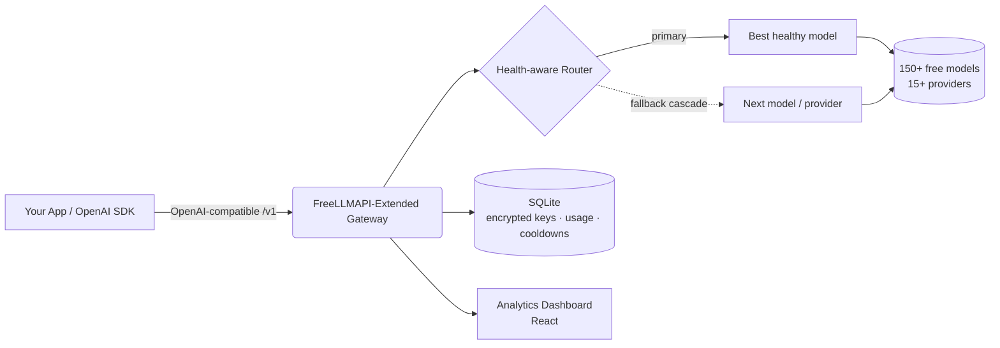
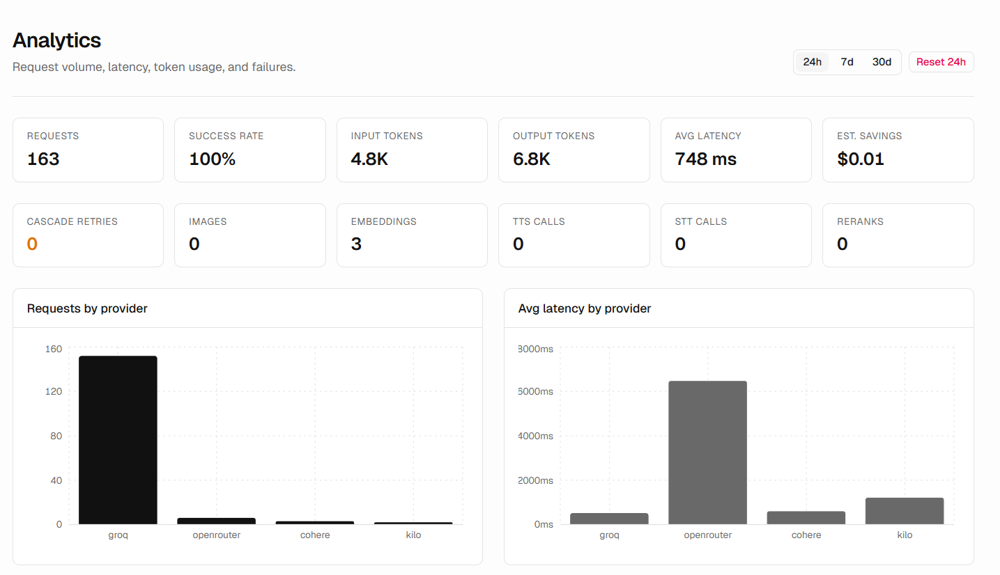

<div align="center">

# FreeLLMAPI-Extended

### Um único endpoint compatível com OpenAI na frente de mais de 150 LLMs gratuitos — com roteamento consciente da saúde, fallback automático e um painel de análise completo.

**Gateway e agregador de LLM auto-hospedado e de código aberto.** Encaminhe chat, visão, geração de imagens, embeddings, áudio (STT/TTS) e reranking para mais de 15 provedores gratuitos através de uma única API compatível com OpenAI — com failover inteligente para que seu aplicativo nunca caia quando um provedor aplicar limite de taxa.

[](LICENSE)
[](https://www.typescriptlang.org/)
[](#-uso-da-api)
[](#-provedores-suportados)
[](#-provedores-suportados)
[](#-recursos)

**🌍 Leia isto no seu idioma:**
[English](README.md) ·
[Türkçe](README.tr.md) ·
[中文](README.zh.md) ·
[日本語](README.ja.md) ·
[한국어](README.ko.md) ·
[Español](README.es.md) ·
[Português](README.pt.md) ·
[Русский](README.ru.md)

</div>

---

## 📖 O que é o FreeLLMAPI-Extended?

**O FreeLLMAPI-Extended é um gateway de API de LLM gratuito e auto-hospedado.** Ele expõe um único endpoint REST compatível com OpenAI e encaminha de forma transparente cada requisição para o melhor modelo gratuito disponível entre mais de 15 provedores (Google Gemini, Groq, Cerebras, Cloudflare Workers AI, Mistral, OpenRouter, GitHub Models, Cohere, SambaNova, NVIDIA NIM, Z.ai e outros).

Quando um provedor aplica limite de taxa, retorna erro ou fica fora do ar, o gateway **automaticamente faz cascata para o próximo modelo saudável** — seu aplicativo continua funcionando sem nenhuma alteração de código. Aponte qualquer SDK da OpenAI para a URL do seu gateway e você obtém instantaneamente inferência gratuita, multiprovedora e tolerante a falhas.

> Substituto direto (drop-in) para a API da OpenAI. Mude uma única URL base — mantenha seu código existente.

---

## ✨ Recursos

| Capacidade | O que você obtém |
|---|---|
| 🔌 **Compatível com OpenAI** | `/v1/chat/completions`, `/v1/embeddings`, `/v1/images/generations`, `/v1/audio/{speech,transcriptions}`, `/v1/rerank`, `/v1/batches`. Funciona com os SDKs oficiais da OpenAI para Python/Node sem alterações. |
| 🧠 **Roteamento automático consciente da saúde** | Os modelos são classificados pela taxa de sucesso e latência **medidas** (não apenas por especificações estáticas), de forma que o modelo confiável mais rápido lidere. Modelos mortos/lentos afundam automaticamente. |
| 🔁 **Cascata de fallback automática** | Failover por requisição entre modelos e provedores, com cooldowns adaptativos (classes minuto / dia / rota morta). Um provedor que cai nunca faz uma requisição falhar. |
| 👁️ **Visão (multimodal)** | Envie imagens junto com seus prompts. O roteamento consciente de visão escolhe automaticamente um modelo capaz de processar imagens. |
| 🎨 **Geração e edição de imagens** | Texto-para-imagem, imagem-para-imagem, inpainting, outpainting (FLUX, SDXL, CogView, Pollinations e outros). |
| 🔢 **Embeddings e Reranking** | Embeddings multiprovedores (BGE-M3, Gemini, Cohere, Mistral) + reranking da Cohere para pipelines RAG. |
| 🔊 **Áudio** | Fala-para-texto (Whisper) e texto-para-fala em uma única API. |
| 📦 **Batch API** | Processamento em lote assíncrono no estilo OpenAI com webhooks (assinados com HMAC), tentativas de repetição e resultados em NDJSON. |
| 🧩 **Saída estruturada e ferramentas** | Modo JSON, JSON schema, chamada de função/ferramenta (tool calling) e streaming (SSE). |
| 🗝️ **Provedores sem chave** | Alguns provedores (Pollinations, Kilo) funcionam **sem nenhuma chave de API** — capacidade de transbordo gratuita pronta para uso. |
| 👥 **Chaves por projeto + controle de gastos** | Emita chaves de API nomeadas por projeto, acompanhe o uso por chave e imponha limites de gasto diário/semanal/mensal por usuário final. |
| 📊 **Painel de análise** | Volume de requisições em tempo real, taxa de sucesso, latência, uso de tokens, estimativas de custo, repetições em cascata e detalhamentos por chave. |
| 🔐 **Armazenamento de chaves criptografado** | As chaves dos provedores são criptografadas em repouso com AES-256-GCM. |
| 🤖 **Aliases de modelo** | Cadeias fixas e à prova de reordenação (por exemplo, um alias `coding` para agentes de programação) para roteamento determinístico. |
| 🩺 **Sondagem de saúde diária** | Um job agendado sonda cada modelo e compara catálogos upstream, de forma que modelos mortos sejam detectados antes que seus usuários os encontrem. |
| 🧰 **Servidor MCP incluído** | Um servidor Model Context Protocol para que clientes MCP possam usar o gateway diretamente. |

**6 modalidades · mais de 15 provedores · mais de 150 modelos gratuitos · 1 endpoint.**

---

## 🏗️ Arquitetura



- **Backend:** Node.js + TypeScript + Express, `better-sqlite3` (sem banco de dados externo).
- **Frontend:** painel React de análise e gerenciamento de chaves.
- **Armazenamento:** SQLite — chaves dos provedores criptografadas com AES-256-GCM.
- **Roteamento:** cascata por requisição com cooldowns persistentes e classificados (sobrevive a reinicializações).

---

## 🚀 Início Rápido

```bash
# 1. Clone
git clone https://github.com/SeyhmusKaya/freellmapi-extended.git
cd freellmapi-extended

# 2. Install
npm install

# 3. Configure
cp .env.example .env
# Generate an encryption key:
node -e "console.log(require('crypto').randomBytes(32).toString('hex'))"
# Paste it into .env as ENCRYPTION_KEY=...

# 4. Run (server + dashboard)
npm run dev
```

Abra o painel, adicione uma chave de provedor gratuito (ou use provedores sem chave) e você estará no ar. Consulte [`.env.example`](.env.example) para todas as opções de configuração.

---

## 🔌 Uso da API

Aponte **qualquer** SDK da OpenAI para o seu gateway. Deixe o campo `model` vazio para fazer o roteamento automático para o melhor modelo disponível.

### Python (OpenAI SDK)

```python
from openai import OpenAI

client = OpenAI(
    base_url="http://localhost:3001/v1",   # your gateway
    api_key="YOUR_GATEWAY_KEY",
)

resp = client.chat.completions.create(
    model="",  # empty = auto-route across all free providers
    messages=[{"role": "user", "content": "Explain quantum computing in one sentence."}],
)
print(resp.choices[0].message.content)
```

### cURL

```bash
curl http://localhost:3001/v1/chat/completions \
  -H "Authorization: Bearer YOUR_GATEWAY_KEY" \
  -H "Content-Type: application/json" \
  -d '{"messages":[{"role":"user","content":"Hello!"}]}'
```

### Visão (imagem + texto)

```json
{
  "messages": [{
    "role": "user",
    "content": [
      {"type": "text", "text": "What is in this image?"},
      {"type": "image_url", "image_url": {"url": "data:image/jpeg;base64,..."}}
    ]
  }]
}
```

Os cabeçalhos de resposta expõem a decisão de roteamento: `X-Routed-Via: groq/llama-4-scout` e `X-Fallback-Attempts: 0`.

---

## 🧠 Roteamento Inteligente

O que diferencia o FreeLLMAPI-Extended de um proxy simples:

- **Saúde medida, não suposições.** A cadeia de fallback é continuamente reclassificada com base na taxa de sucesso real de 7 dias e na latência de cada modelo. Um modelo que começa a falhar afunda automaticamente; um modelo rápido e confiável sobe.
- **Cooldowns classificados.** Os erros são agrupados (limite de taxa por minuto, cota por dia, rota morta, chave inválida) e cada um recebe o cooldown adequado — uma cota diária espera até a meia-noite UTC, um pico transitório espera segundos.
- **Cascata em tudo.** 404 / 429 / 5xx / timeout / erros 400 específicos do provedor — todos disparam um pular-e-continuar para o próximo modelo, de forma que um único endpoint problemático nunca afunde uma requisição.
- **Transbordo sem chave.** Provedores anônimos atuam como capacidade de último recurso, de modo que você continua atendendo mesmo quando todos os provedores com chave estão com limite de taxa.
- **Limites de gasto por usuário final.** Atribua o custo aos seus próprios usuários finais e limite o gasto diário/semanal/mensal.

---

## 🌐 Provedores Suportados

Chat de texto, visão, geração de imagens, embeddings, áudio (STT/TTS) e reranking através de:

**Google Gemini · Groq · Cerebras · Cloudflare Workers AI · Mistral · OpenRouter · GitHub Models · Cohere · SambaNova · NVIDIA NIM · Z.ai (Zhipu) · Pollinations (sem chave) · Kilo Gateway (sem chave) · AI21 · Reka** — e um caminho fácil para adicionar qualquer provedor compatível com OpenAI.

> Os limites do nível gratuito, as listas de modelos e as observações por provedor estão documentados em [`docs/FREE-PROVIDERS-RESEARCH.md`](docs/FREE-PROVIDERS-RESEARCH.md).

---

## 📊 Painel

Um painel React integrado para chaves, roteamento e análise:

- **Análise** — volume de requisições, taxa de sucesso real, latência, uso de tokens, estimativas de custo, repetições em cascata, detalhamento por chave de API.
- **Chaves** — adicione/rotacione/desative chaves de provedores (criptografadas em repouso) e emita chaves de consumidor por projeto.
- **Fallback** — visualize e reordene a cadeia de roteamento, ou ordene pela qualidade medida.
- **Playground** — teste modelos diretamente do navegador.

<!-- Screenshots: place dashboard images in /repo-assets and reference them here. -->
<!--  -->

---

## 📚 Documentação

| Documento | Descrição |
|---|---|
| [`docs/FREE-PROVIDERS-RESEARCH.md`](docs/FREE-PROVIDERS-RESEARCH.md) | Matriz completa de provedores/modelos, limites do nível gratuito, changelog |
| [`docs/BATCH-API.md`](docs/BATCH-API.md) | Guia do consumidor da Batch API assíncrona |
| [`docs/IMAGE-GEN-PLAN.md`](docs/IMAGE-GEN-PLAN.md) | Geração e edição de imagens |
| [`docs/VISION-PLAN.md`](docs/VISION-PLAN.md) | Visão / multimodal |
| [`docs/STRUCTURED-OUTPUT-PLAN.md`](docs/STRUCTURED-OUTPUT-PLAN.md) | Modo JSON e saída estruturada |
| [`mcp/README.md`](mcp/README.md) | Servidor Model Context Protocol |

---

## ❓ Perguntas Frequentes

**É realmente gratuito?**
Sim — ele agrega os níveis gratuitos de muitos provedores. Você fornece chaves de API gratuitas (ou usa provedores sem chave). O próprio gateway é licenciado sob MIT e auto-hospedado.

**É compatível com OpenAI?**
Sim. Ele implementa os formatos de Chat Completions, Embeddings, Images, Audio e Batch da OpenAI. A maioria dos aplicativos só precisa alterar a URL base.

**O que acontece quando um provedor está com limite de taxa ou fora do ar?**
A requisição faz cascata automaticamente para o próximo modelo/provedor saudável. O chamador nunca vê a falha — apenas um cabeçalho `X-Routed-Via` ligeiramente diferente.

**Preciso de um servidor de banco de dados?**
Não. Ele usa SQLite embarcado (`better-sqlite3`). As chaves dos provedores são criptografadas com AES-256-GCM.

**Posso adicionar meu próprio provedor?**
Sim — qualquer endpoint compatível com OpenAI pode ser registrado com uma URL base.

**Como isso é diferente de um proxy simples?**
Reclassificação consciente da saúde, cooldowns adaptativos classificados, cascata por requisição, transbordo sem chave, processamento em lote, limites de gasto por usuário final e um painel de análise completo.

---

## 🙏 Créditos e Atribuição

O FreeLLMAPI-Extended é construído **sobre e inspirado** no excelente trabalho de código aberto de
**[tashfeenahmed/freellmapi](https://github.com/tashfeenahmed/freellmapi)** por [@tashfeenahmed](https://github.com/tashfeenahmed) — um enorme agradecimento pela base original. Este projeto o estende com modalidades adicionais, roteamento consciente da saúde, processamento em lote, cobrança por usuário final, provedores sem chave e um painel de análise redesenhado.

Licenciado sob **MIT** (igual ao upstream) — veja [LICENSE](LICENSE).

---

## 🤝 Contribuindo

Issues e pull requests são bem-vindos. Seja um novo provedor gratuito, uma melhoria de roteamento, uma correção de bug ou documentação — contribuições de qualquer tamanho ajudam.

---

<div align="center">

**FreeLLMAPI-Extended** — gateway de LLM gratuito e compatível com OpenAI · agregador de API de IA multiprovedor · roteador de LLM auto-hospedado com fallback automático.

⭐ Se este projeto te ajuda, por favor, dê uma estrela para apoiar o desenvolvimento.

<sub>Palavras-chave: API de LLM gratuita, gateway compatível com OpenAI, agregador de LLM, roteador de IA multiprovedor, alternativa gratuita à API GPT, gateway de IA auto-hospedado, fallback de LLM, API gratuita Gemini Groq Cerebras Cloudflare, proxy de IA, API de embeddings gratuita, API de geração de imagens gratuita.</sub>

</div>
