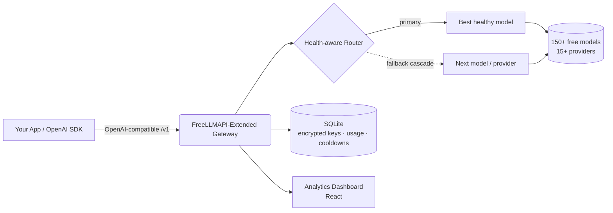

<div align="center">


# FreeLLMAPI-Extended

### Единая OpenAI-совместимая точка входа перед 150+ бесплатными LLM — с маршрутизацией по состоянию моделей, автоматическим резервированием и полноценной панелью аналитики.

**Самостоятельно размещаемый LLM-шлюз и агрегатор с открытым исходным кодом.** Направляйте запросы чата, зрения, генерации изображений, эмбеддингов, аудио (STT/TTS) и переранжирования к 15+ бесплатным провайдерам через единый OpenAI-совместимый API — с интеллектуальным переключением при сбоях, чтобы ваше приложение никогда не падало, когда один из провайдеров упирается в лимит запросов.

[](LICENSE)
[](https://www.typescriptlang.org/)
[](#-использование-api)
[](#-поддерживаемые-провайдеры)
[](#-поддерживаемые-провайдеры)
[](#-возможности)

**🌍 Читать на вашем языке:**
[English](README.md) ·
[Türkçe](README.tr.md) ·
[中文](README.zh.md) ·
[日本語](README.ja.md) ·
[한국어](README.ko.md) ·
[Español](README.es.md) ·
[Português](README.pt.md) ·
[Русский](README.ru.md)

</div>

---

## 📖 Что такое FreeLLMAPI-Extended?

**FreeLLMAPI-Extended — это бесплатный, самостоятельно размещаемый шлюз LLM API.** Он предоставляет единую OpenAI-совместимую REST-точку входа и прозрачно направляет каждый запрос к лучшей доступной бесплатной модели среди 15+ провайдеров (Google Gemini, Groq, Cerebras, Cloudflare Workers AI, Mistral, OpenRouter, GitHub Models, Cohere, SambaNova, NVIDIA NIM, Z.ai и других).

Когда провайдер упирается в лимит запросов, возвращает ошибку или становится недоступен, шлюз **автоматически каскадом переключается на следующую исправную модель** — ваше приложение продолжает работать без единого изменения в коде. Направьте любой OpenAI SDK на URL вашего шлюза и мгновенно получите бесплатный, мультипровайдерный и отказоустойчивый инференс.

> Полноценная замена OpenAI API. Поменяйте один базовый URL — и сохраните существующий код.

---

## ✨ Возможности

| Возможность | Что вы получаете |
|---|---|
| 🔌 **OpenAI-совместимость** | `/v1/chat/completions`, `/v1/embeddings`, `/v1/images/generations`, `/v1/audio/{speech,transcriptions}`, `/v1/rerank`, `/v1/batches`. Работает с официальными OpenAI Python/Node SDK без изменений. |
| 🧠 **Авто-маршрутизация по состоянию** | Модели ранжируются по **измеренному** уровню успешных ответов и задержке (а не только по статическим характеристикам), поэтому самая быстрая и надёжная модель идёт первой. Мёртвые/медленные модели опускаются автоматически. |
| 🔁 **Автоматический каскад резервирования** | Переключение при сбоях для каждого запроса между моделями и провайдерами с адаптивными паузами охлаждения (классы: минута / сутки / мёртвый маршрут). Сбой одного провайдера никогда не приводит к отказу запроса. |
| 👁️ **Зрение (мультимодальность)** | Отправляйте изображения вместе с промптами. Маршрутизация с учётом зрения автоматически выбирает модель, поддерживающую распознавание изображений. |
| 🎨 **Генерация и редактирование изображений** | Текст-в-изображение, изображение-в-изображение, инпейнтинг, аутпейнтинг (FLUX, SDXL, CogView, Pollinations и другие). |
| 🔢 **Эмбеддинги и переранжирование** | Мультипровайдерные эмбеддинги (BGE-M3, Gemini, Cohere, Mistral) + переранжирование Cohere для RAG-пайплайнов. |
| 🔊 **Аудио** | Распознавание речи (Whisper) и синтез речи в одном API. |
| 📦 **Batch API** | Асинхронная пакетная обработка в стиле OpenAI с вебхуками (подписанными HMAC), повторными попытками и результатами в формате NDJSON. |
| 🧩 **Структурированный вывод и инструменты** | Режим JSON, JSON-схема, вызов функций/инструментов и потоковая передача (SSE). |
| 🗝️ **Провайдеры без ключа** | Некоторые провайдеры (Pollinations, Kilo) работают **вообще без API-ключа** — бесплатная резервная ёмкость прямо из коробки. |
| 👥 **Ключи по проектам + контроль расходов** | Выпускайте именованные API-ключи для каждого проекта, отслеживайте использование по каждому ключу и устанавливайте дневные/недельные/месячные лимиты расходов для каждого конечного пользователя. |
| 📊 **Панель аналитики** | Объём запросов в реальном времени, уровень успешных ответов, задержка, расход токенов, оценка затрат, каскадные повторы и разбивка по ключам. |
| 🔐 **Зашифрованное хранение ключей** | Ключи провайдеров шифруются на диске с помощью AES-256-GCM. |
| 🤖 **Псевдонимы моделей** | Фиксированные, устойчивые к переупорядочиванию цепочки (например, псевдоним `coding` для кодинг-агентов) для детерминированной маршрутизации. |
| 🩺 **Ежедневная проверка состояния** | Запланированная задача проверяет каждую модель и сравнивает каталоги провайдеров, поэтому мёртвые модели выявляются раньше, чем на них наткнутся ваши пользователи. |
| 🧰 **Встроенный MCP-сервер** | Сервер Model Context Protocol, чтобы MCP-клиенты могли использовать шлюз напрямую. |

**6 модальностей · 15+ провайдеров · 150+ бесплатных моделей · 1 точка входа.**

---

## 🏗️ Архитектура



- **Бэкенд:** Node.js + TypeScript + Express, `better-sqlite3` (без внешней БД).
- **Фронтенд:** React-панель аналитики и управления ключами.
- **Хранилище:** SQLite — ключи провайдеров зашифрованы с помощью AES-256-GCM.
- **Маршрутизация:** покадровый каскад для каждого запроса с постоянными, классифицированными паузами охлаждения (сохраняются после перезапуска).

---

## 🚀 Быстрый старт

```bash
# 1. Clone
git clone https://github.com/SeyhmusKaya/freellmapi-extended.git
cd freellmapi-extended

# 2. Install
npm install

# 3. Configure
cp .env.example .env
# Generate an encryption key:
node -e "console.log(require('crypto').randomBytes(32).toString('hex'))"
# Paste it into .env as ENCRYPTION_KEY=...

# 4. Run (server + dashboard)
npm run dev
```

Откройте панель, добавьте бесплатный ключ провайдера (или используйте провайдеров без ключа) — и всё готово к работе. Все параметры конфигурации смотрите в [`.env.example`](.env.example).

---

## 🔌 Использование API

Направьте **любой** OpenAI SDK на ваш шлюз. Оставьте поле `model` пустым для автоматической маршрутизации к лучшей доступной модели.

### Python (OpenAI SDK)

```python
from openai import OpenAI

client = OpenAI(
    base_url="http://localhost:3001/v1",   # your gateway
    api_key="YOUR_GATEWAY_KEY",
)

resp = client.chat.completions.create(
    model="",  # empty = auto-route across all free providers
    messages=[{"role": "user", "content": "Explain quantum computing in one sentence."}],
)
print(resp.choices[0].message.content)
```

### cURL

```bash
curl http://localhost:3001/v1/chat/completions \
  -H "Authorization: Bearer YOUR_GATEWAY_KEY" \
  -H "Content-Type: application/json" \
  -d '{"messages":[{"role":"user","content":"Hello!"}]}'
```

### Зрение (изображение + текст)

```json
{
  "messages": [{
    "role": "user",
    "content": [
      {"type": "text", "text": "What is in this image?"},
      {"type": "image_url", "image_url": {"url": "data:image/jpeg;base64,..."}}
    ]
  }]
}
```

Заголовки ответа раскрывают принятое решение о маршрутизации: `X-Routed-Via: groq/llama-4-scout` и `X-Fallback-Attempts: 0`.

---

## 🧠 Интеллектуальная маршрутизация

Что отличает FreeLLMAPI-Extended от простого прокси:

- **Измеренное состояние, а не догадки.** Цепочка резервирования непрерывно переранжируется на основе реального 7-дневного уровня успешных ответов и задержки каждой модели. Модель, которая начинает сбоить, опускается автоматически; быстрая и надёжная — поднимается.
- **Классифицированные паузы охлаждения.** Ошибки распределяются по категориям (поминутный лимит запросов, суточная квота, мёртвый маршрут, недействительный ключ), и каждая получает подходящую паузу охлаждения — суточная квота ждёт до полуночи по UTC, кратковременный всплеск ждёт секунды.
- **Каскад на всё подряд.** 404 / 429 / 5xx / тайм-аут / специфичные для провайдера ответы 400 — всё это запускает переход «пропустить и продолжить» к следующей модели, поэтому одна капризная точка входа никогда не топит запрос.
- **Резерв без ключа.** Анонимные провайдеры работают как ёмкость на крайний случай, поэтому вы продолжаете обслуживать запросы, даже когда все провайдеры с ключами упёрлись в лимит.
- **Лимиты расходов для каждого конечного пользователя.** Привязывайте затраты к вашим собственным конечным пользователям и устанавливайте дневной/недельный/месячный потолок расходов.

---

## 🌐 Поддерживаемые провайдеры

Текстовый чат, зрение, генерация изображений, эмбеддинги, аудио (STT/TTS) и переранжирование через:

**Google Gemini · Groq · Cerebras · Cloudflare Workers AI · Mistral · OpenRouter · GitHub Models · Cohere · SambaNova · NVIDIA NIM · Z.ai (Zhipu) · Pollinations (без ключа) · Kilo Gateway (без ключа) · AI21 · Reka** — а также простой способ добавить любого OpenAI-совместимого провайдера.

> Лимиты бесплатных тарифов, списки моделей и заметки по каждому провайдеру задокументированы в [`docs/FREE-PROVIDERS-RESEARCH.md`](docs/FREE-PROVIDERS-RESEARCH.md).

---

## 📊 Панель управления

Встроенная React-панель для ключей, маршрутизации и аналитики:

- **Аналитика** — объём запросов, реальный уровень успешных ответов, задержка, расход токенов, оценка затрат, каскадные повторы, разбивка по каждому API-ключу.
- **Ключи** — добавление/ротация/отключение ключей провайдеров (зашифрованных на диске) и выпуск потребительских ключей по проектам.
- **Резервирование** — просмотр и переупорядочивание цепочки маршрутизации либо сортировка по измеренному качеству.
- **Песочница** — тестирование моделей прямо из браузера.

<p align="center">
  
  
</p>
<p align="center">
  
</p>

---

## 📚 Документация

| Документ | Описание |
|---|---|
| [`docs/FREE-PROVIDERS-RESEARCH.md`](docs/FREE-PROVIDERS-RESEARCH.md) | Полная матрица провайдеров/моделей, лимиты бесплатных тарифов, история изменений |
| [`docs/BATCH-API.md`](docs/BATCH-API.md) | Руководство по асинхронному Batch API для потребителей |
| [`docs/IMAGE-GEN-PLAN.md`](docs/IMAGE-GEN-PLAN.md) | Генерация и редактирование изображений |
| [`docs/VISION-PLAN.md`](docs/VISION-PLAN.md) | Зрение / мультимодальность |
| [`docs/STRUCTURED-OUTPUT-PLAN.md`](docs/STRUCTURED-OUTPUT-PLAN.md) | Режим JSON и структурированный вывод |
| [`mcp/README.md`](mcp/README.md) | Сервер Model Context Protocol |

---

## ❓ Часто задаваемые вопросы

**Это действительно бесплатно?**
Да — проект агрегирует бесплатные тарифы множества провайдеров. Вы предоставляете бесплатные API-ключи (или используете провайдеров без ключа). Сам шлюз распространяется по лицензии MIT и размещается самостоятельно.

**Совместимо ли это с OpenAI?**
Да. Реализованы форматы OpenAI Chat Completions, Embeddings, Images, Audio и Batch. Большинству приложений нужно только поменять базовый URL.

**Что происходит, когда провайдер упёрся в лимит или недоступен?**
Запрос автоматически каскадом переходит к следующей исправной модели/провайдеру. Вызывающая сторона никогда не видит сбоя — лишь слегка отличающийся заголовок `X-Routed-Via`.

**Нужен ли мне сервер базы данных?**
Нет. Используется встроенный SQLite (`better-sqlite3`). Ключи провайдеров шифруются с помощью AES-256-GCM.

**Могу ли я добавить своего провайдера?**
Да — любую OpenAI-совместимую точку входа можно зарегистрировать, указав базовый URL.

**Чем это отличается от обычного прокси?**
Переранжированием по состоянию моделей, классифицированными адаптивными паузами охлаждения, покадровым каскадом для каждого запроса, резервом без ключа, пакетной обработкой, лимитами расходов для каждого конечного пользователя и полноценной панелью аналитики.

---

## 🙏 Благодарности и упоминания

FreeLLMAPI-Extended построен **на основе и вдохновлён** превосходной работой с открытым исходным кодом
**[tashfeenahmed/freellmapi](https://github.com/tashfeenahmed/freellmapi)** от [@tashfeenahmed](https://github.com/tashfeenahmed) — огромная благодарность за изначальный фундамент. Этот проект расширяет его дополнительными модальностями, маршрутизацией по состоянию моделей, пакетной обработкой, биллингом по каждому конечному пользователю, провайдерами без ключа и переработанной панелью аналитики.

Распространяется по лицензии **MIT** (как и оригинал) — см. [LICENSE](LICENSE).

---

## 🤝 Участие в разработке

Issue и pull request приветствуются. Будь то новый бесплатный провайдер, улучшение маршрутизации, исправление ошибки или документация — вклад любого размера помогает.

---

<div align="center">

**FreeLLMAPI-Extended** — бесплатный OpenAI-совместимый LLM-шлюз · мультипровайдерный агрегатор AI API · самостоятельно размещаемый LLM-маршрутизатор с автоматическим резервированием.

⭐ Если этот проект вам помогает, поставьте звезду, чтобы поддержать разработку.

<sub>Ключевые слова: бесплатный LLM API, OpenAI-совместимый шлюз, агрегатор LLM, мультипровайдерный AI-маршрутизатор, бесплатная альтернатива GPT API, самостоятельно размещаемый AI-шлюз, резервирование LLM, бесплатный API Gemini Groq Cerebras Cloudflare, AI-прокси, бесплатный API эмбеддингов, бесплатный API генерации изображений.</sub>

</div>
