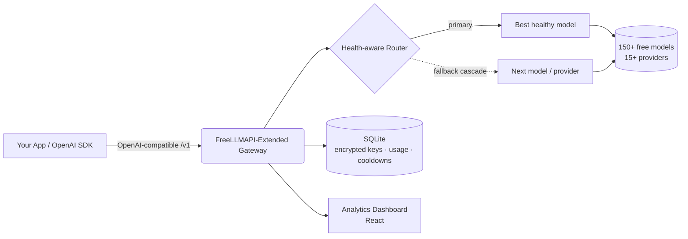

<div align="center">


# FreeLLMAPI-Extended

### 150'den fazla ücretsiz LLM'in önünde tek bir OpenAI uyumlu uç nokta — sağlık duyarlı yönlendirme, otomatik yedeğe geçiş ve eksiksiz bir analiz panosu ile.

**Kendi sunucunuzda barındırılan, açık kaynaklı LLM ağ geçidi ve toplayıcısı.** Sohbet, görüntü işleme (vision), görsel üretimi, embedding, ses (STT/TTS) ve yeniden sıralama (reranking) isteklerini tek bir OpenAI uyumlu API üzerinden 15'ten fazla ücretsiz sağlayıcıya yönlendirin — bir sağlayıcı hız sınırına takıldığında uygulamanızın asla çökmemesi için akıllı yük devretme (failover) ile.

[](LICENSE)
[](https://www.typescriptlang.org/)
[](#-api-kullanımı)
[](#-desteklenen-sağlayıcılar)
[](#-desteklenen-sağlayıcılar)
[](#-özellikler)

**🌍 Read this in your language:**
[English](README.md) ·
[Türkçe](README.tr.md) ·
[中文](README.zh.md) ·
[日本語](README.ja.md) ·
[한국어](README.ko.md) ·
[Español](README.es.md) ·
[Português](README.pt.md) ·
[Русский](README.ru.md)

</div>

---

## 📖 FreeLLMAPI-Extended Nedir?

**FreeLLMAPI-Extended, ücretsiz ve kendi sunucunuzda barındırabileceğiniz bir LLM API ağ geçididir.** Tek bir OpenAI uyumlu REST uç noktası sunar ve her isteği 15'ten fazla sağlayıcı (Google Gemini, Groq, Cerebras, Cloudflare Workers AI, Mistral, OpenRouter, GitHub Models, Cohere, SambaNova, NVIDIA NIM, Z.ai ve daha fazlası) arasından mevcut en iyi ücretsiz modele şeffaf bir biçimde yönlendirir.

Bir sağlayıcı hız sınırına takıldığında, hata verdiğinde veya çöktüğünde, ağ geçidi **otomatik olarak bir sonraki sağlıklı modele kademeli geçiş yapar (cascade)** — uygulamanız hiçbir kod değişikliği gerektirmeden çalışmaya devam eder. Herhangi bir OpenAI SDK'sını ağ geçidi URL'nize yönlendirin ve anında ücretsiz, çoklu sağlayıcılı, hataya dayanıklı çıkarım (inference) elde edin.

> OpenAI API'sinin yerine doğrudan geçen (drop-in) bir alternatif. Tek bir temel URL değiştirin — mevcut kodunuzu koruyun.

---

## ✨ Özellikler

| Yetenek | Size sunduğu |
|---|---|
| 🔌 **OpenAI uyumlu** | `/v1/chat/completions`, `/v1/embeddings`, `/v1/images/generations`, `/v1/audio/{speech,transcriptions}`, `/v1/rerank`, `/v1/batches`. Resmi OpenAI Python/Node SDK'ları ile değişiklik yapılmadan çalışır. |
| 🧠 **Sağlık duyarlı otomatik yönlendirme** | Modeller yalnızca statik özelliklerine göre değil, **ölçülen** başarı oranı + gecikmeye (latency) göre sıralanır; böylece en hızlı ve güvenilir model başa geçer. Ölü/yavaş modeller otomatik olarak dibe iner. |
| 🔁 **Otomatik yedeğe geçiş kademesi** | Modeller ve sağlayıcılar arasında istek başına yük devretme; uyarlanabilir bekleme süreleri (cooldown) ile (dakika / gün / ölü rota sınıfları). Bir sağlayıcının çökmesi bir isteği asla başarısız kılmaz. |
| 👁️ **Görüntü işleme (multimodal)** | İsteklerinizle birlikte görsel gönderin. Görüntü işleme duyarlı yönlendirme, otomatik olarak görüntü işleyebilen bir model seçer. |
| 🎨 **Görsel üretimi ve düzenleme** | Metinden görsele, görselden görsele, iç boyama (inpainting), dış boyama (outpainting) (FLUX, SDXL, CogView, Pollinations ve daha fazlası). |
| 🔢 **Embedding ve yeniden sıralama** | Çoklu sağlayıcılı embedding (BGE-M3, Gemini, Cohere, Mistral) + RAG hatları için Cohere yeniden sıralama. |
| 🔊 **Ses** | Tek bir API'de konuşmadan metne (Whisper) ve metinden konuşmaya. |
| 📦 **Batch API** | Webhook'lar (HMAC ile imzalı), yeniden denemeler ve NDJSON sonuçları içeren OpenAI tarzı asenkron toplu işleme. |
| 🧩 **Yapılandırılmış çıktı ve araçlar** | JSON modu, JSON şeması, fonksiyon/araç çağrısı (tool calling) ve akış (streaming, SSE). |
| 🗝️ **Anahtarsız sağlayıcılar** | Bazı sağlayıcılar (Pollinations, Kilo) **hiçbir API anahtarı olmadan** çalışır — kutudan çıktığı gibi ücretsiz taşma kapasitesi. |
| 👥 **Proje başına anahtarlar + harcama kontrolü** | Her proje için adlandırılmış API anahtarları oluşturun, anahtar başına kullanımı izleyin ve son kullanıcı başına günlük/haftalık/aylık harcama limitleri uygulayın. |
| 📊 **Analiz panosu** | Gerçek zamanlı istek hacmi, başarı oranı, gecikme, token kullanımı, maliyet tahminleri, kademe yeniden denemeleri ve anahtar bazında dökümler. |
| 🔐 **Şifreli anahtar depolama** | Sağlayıcı anahtarları beklemede AES-256-GCM ile şifrelenir. |
| 🤖 **Model takma adları (alias)** | Belirleyici yönlendirme için sabit, sırası değişmeyen zincirler (örn. kodlama ajanları için bir `coding` takma adı). |
| 🩺 **Günlük sağlık yoklaması** | Zamanlanmış bir görev her modeli yoklar ve yukarı akış (upstream) kataloglarını karşılaştırır; böylece ölü modeller kullanıcılarınız onlara denk gelmeden yakalanır. |
| 🧰 **Dahili MCP sunucusu** | MCP istemcilerinin ağ geçidini doğrudan kullanabilmesi için bir Model Context Protocol sunucusu. |

**6 modalite · 15+ sağlayıcı · 150+ ücretsiz model · 1 uç nokta.**

---

## 🏗️ Mimari



- **Arka uç (Backend):** Node.js + TypeScript + Express, `better-sqlite3` (harici veritabanı yok).
- **Ön uç (Frontend):** React analiz ve anahtar yönetimi panosu.
- **Depolama:** SQLite — sağlayıcı anahtarları AES-256-GCM ile şifrelenir.
- **Yönlendirme:** kalıcı, sınıflandırılmış bekleme süreleriyle istek başına kademeli geçiş (yeniden başlatmalarda korunur).

---

## 🚀 Hızlı Başlangıç

```bash
# 1. Clone
git clone https://github.com/SeyhmusKaya/freellmapi-extended.git
cd freellmapi-extended

# 2. Install
npm install

# 3. Configure
cp .env.example .env
# Generate an encryption key:
node -e "console.log(require('crypto').randomBytes(32).toString('hex'))"
# Paste it into .env as ENCRYPTION_KEY=...

# 4. Run (server + dashboard)
npm run dev
```

Panoyu açın, ücretsiz bir sağlayıcı anahtarı ekleyin (veya anahtarsız sağlayıcıları kullanın) ve yayına başlayın. Tüm yapılandırma seçenekleri için [`.env.example`](.env.example) dosyasına bakın.

---

## 🔌 API Kullanımı

**Herhangi bir** OpenAI SDK'sını ağ geçidinize yönlendirin. Mevcut en iyi modele otomatik yönlendirme için `model` alanını boş bırakın.

### Python (OpenAI SDK)

```python
from openai import OpenAI

client = OpenAI(
    base_url="http://localhost:3001/v1",   # your gateway
    api_key="YOUR_GATEWAY_KEY",
)

resp = client.chat.completions.create(
    model="",  # empty = auto-route across all free providers
    messages=[{"role": "user", "content": "Explain quantum computing in one sentence."}],
)
print(resp.choices[0].message.content)
```

### cURL

```bash
curl http://localhost:3001/v1/chat/completions \
  -H "Authorization: Bearer YOUR_GATEWAY_KEY" \
  -H "Content-Type: application/json" \
  -d '{"messages":[{"role":"user","content":"Hello!"}]}'
```

### Görüntü işleme (görsel + metin)

```json
{
  "messages": [{
    "role": "user",
    "content": [
      {"type": "text", "text": "What is in this image?"},
      {"type": "image_url", "image_url": {"url": "data:image/jpeg;base64,..."}}
    ]
  }]
}
```

Yanıt başlıkları yönlendirme kararını açığa çıkarır: `X-Routed-Via: groq/llama-4-scout` ve `X-Fallback-Attempts: 0`.

---

## 🧠 Akıllı Yönlendirme

FreeLLMAPI-Extended'ı basit bir proxy'den ayıran şey:

- **Tahmin değil, ölçülen sağlık.** Yedeğe geçiş zinciri, her modelin gerçek 7 günlük başarı oranı ve gecikmesinden sürekli olarak yeniden sıralanır. Hata vermeye başlayan bir model otomatik olarak dibe iner; hızlı ve güvenilir olan ise yükselir.
- **Sınıflandırılmış bekleme süreleri.** Hatalar kovalara ayrılır (dakika başına hız sınırı, gün başına kota, ölü rota, geçersiz anahtar) ve her biri doğru bekleme süresini alır — günlük bir kota UTC gece yarısına kadar bekler, geçici bir patlama (burst) ise saniyeler bekler.
- **Her şeyde kademeli geçiş.** 404 / 429 / 5xx / zaman aşımı / sağlayıcıya özgü 400'ler, hepsi bir sonraki modele atla-ve-devam et davranışını tetikler; böylece tek bir tuhaf uç nokta bir isteği asla batırmaz.
- **Anahtarsız taşma.** Anonim sağlayıcılar son çare kapasitesi olarak çalışır; böylece anahtarlı her sağlayıcı hız sınırına takılsa bile hizmet vermeye devam edersiniz.
- **Son kullanıcı başına harcama limitleri.** Maliyeti kendi son kullanıcılarınıza atfedin ve günlük/haftalık/aylık harcamayı sınırlandırın.

---

## 🌐 Desteklenen Sağlayıcılar

Şunlar arasında metin sohbeti, görüntü işleme, görsel üretimi, embedding, ses (STT/TTS) ve yeniden sıralama:

**Google Gemini · Groq · Cerebras · Cloudflare Workers AI · Mistral · OpenRouter · GitHub Models · Cohere · SambaNova · NVIDIA NIM · Z.ai (Zhipu) · Pollinations (anahtarsız) · Kilo Gateway (anahtarsız) · AI21 · Reka** — ve herhangi bir OpenAI uyumlu sağlayıcıyı eklemek için kolay bir yol.

> Ücretsiz katman limitleri, model listeleri ve sağlayıcı bazında notlar [`docs/FREE-PROVIDERS-RESEARCH.md`](docs/FREE-PROVIDERS-RESEARCH.md) dosyasında belgelenmiştir.

---

## 📊 Pano

Anahtarlar, yönlendirme ve analiz için dahili bir React panosu:

- **Analiz** — istek hacmi, gerçek başarı oranı, gecikme, token kullanımı, maliyet tahminleri, kademe yeniden denemeleri, API anahtarı bazında döküm.
- **Anahtarlar** — sağlayıcı anahtarları ekleyin/döndürün/devre dışı bırakın (beklemede şifreli) ve proje başına tüketici anahtarları oluşturun.
- **Yedeğe geçiş (Fallback)** — yönlendirme zincirini görüntüleyin ve yeniden sıralayın ya da ölçülen kaliteye göre sıralayın.
- **Playground** — modelleri doğrudan tarayıcıdan test edin.

<!-- Screenshots: place dashboard images in /repo-assets and reference them here. -->
<!--  -->

---

## 📚 Belgeler

| Belge | Açıklama |
|---|---|
| [`docs/FREE-PROVIDERS-RESEARCH.md`](docs/FREE-PROVIDERS-RESEARCH.md) | Tam sağlayıcı/model matrisi, ücretsiz katman limitleri, değişiklik günlüğü |
| [`docs/BATCH-API.md`](docs/BATCH-API.md) | Asenkron Batch API tüketici kılavuzu |
| [`docs/IMAGE-GEN-PLAN.md`](docs/IMAGE-GEN-PLAN.md) | Görsel üretimi ve düzenleme |
| [`docs/VISION-PLAN.md`](docs/VISION-PLAN.md) | Görüntü işleme / multimodal |
| [`docs/STRUCTURED-OUTPUT-PLAN.md`](docs/STRUCTURED-OUTPUT-PLAN.md) | JSON modu ve yapılandırılmış çıktı |
| [`mcp/README.md`](mcp/README.md) | Model Context Protocol sunucusu |

---

## ❓ SSS

**Gerçekten ücretsiz mi?**
Evet — birçok sağlayıcının ücretsiz katmanlarını bir araya getirir. Ücretsiz API anahtarları sağlarsınız (veya anahtarsız sağlayıcıları kullanırsınız). Ağ geçidinin kendisi MIT lisanslıdır ve kendi sunucunuzda barındırılır.

**OpenAI uyumlu mu?**
Evet. OpenAI Chat Completions, Embeddings, Images, Audio ve Batch yapılarını uygular. Çoğu uygulamanın yalnızca temel URL'yi değiştirmesi yeterlidir.

**Bir sağlayıcı hız sınırına takıldığında veya çöktüğünde ne olur?**
İstek otomatik olarak bir sonraki sağlıklı modele/sağlayıcıya kademeli geçiş yapar. Çağıran taraf hatayı asla görmez — yalnızca biraz farklı bir `X-Routed-Via` başlığı.

**Bir veritabanı sunucusuna ihtiyacım var mı?**
Hayır. Gömülü SQLite (`better-sqlite3`) kullanır. Sağlayıcı anahtarları AES-256-GCM ile şifrelenir.

**Kendi sağlayıcımı ekleyebilir miyim?**
Evet — herhangi bir OpenAI uyumlu uç nokta bir temel URL ile kaydedilebilir.

**Bu, düz bir proxy'den nasıl farklı?**
Sağlık duyarlı yeniden sıralama, sınıflandırılmış uyarlanabilir bekleme süreleri, istek başına kademeli geçiş, anahtarsız taşma, toplu işleme, son kullanıcı başına harcama limitleri ve eksiksiz bir analiz panosu.

---

## 🙏 Teşekkürler ve Atıf

FreeLLMAPI-Extended, [@tashfeenahmed](https://github.com/tashfeenahmed) tarafından geliştirilen mükemmel açık kaynaklı çalışma **[tashfeenahmed/freellmapi](https://github.com/tashfeenahmed/freellmapi)** **üzerine kurulmuş ve ondan ilham almıştır** — özgün temel için çok teşekkürler. Bu proje, onu ek modaliteler, sağlık duyarlı yönlendirme, toplu işleme, son kullanıcı başına faturalandırma, anahtarsız sağlayıcılar ve yeniden tasarlanmış bir analiz panosu ile genişletir.

**MIT** lisansı altındadır (yukarı akışla aynı) — bkz. [LICENSE](LICENSE).

---

## 🤝 Katkıda Bulunma

Sorunlar (issue) ve çekme istekleri (pull request) memnuniyetle karşılanır. İster yeni bir ücretsiz sağlayıcı, ister bir yönlendirme iyileştirmesi, bir hata düzeltmesi ya da belgeler olsun — her büyüklükteki katkı yardımcı olur.

---

<div align="center">

**FreeLLMAPI-Extended** — ücretsiz OpenAI uyumlu LLM ağ geçidi · çoklu sağlayıcılı yapay zeka API toplayıcısı · otomatik yedeğe geçişli, kendi sunucunuzda barındırılan LLM yönlendiricisi.

⭐ Bu proje işinize yararsa, geliştirilmesini desteklemek için lütfen yıldız verin.

<sub>Anahtar kelimeler: ücretsiz LLM API, OpenAI uyumlu ağ geçidi, LLM toplayıcı, çoklu sağlayıcılı yapay zeka yönlendiricisi, ücretsiz GPT API alternatifi, kendi sunucunuzda barındırılan yapay zeka ağ geçidi, LLM yedeğe geçiş, Gemini Groq Cerebras Cloudflare ücretsiz API, yapay zeka proxy, ücretsiz embedding API, ücretsiz görsel üretimi API.</sub>

</div>
