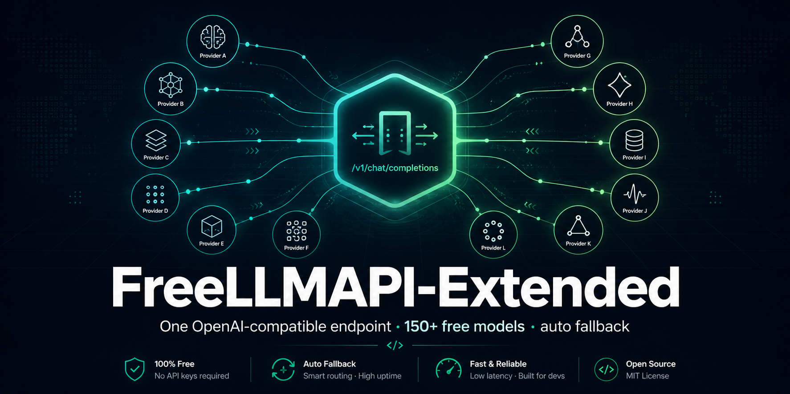
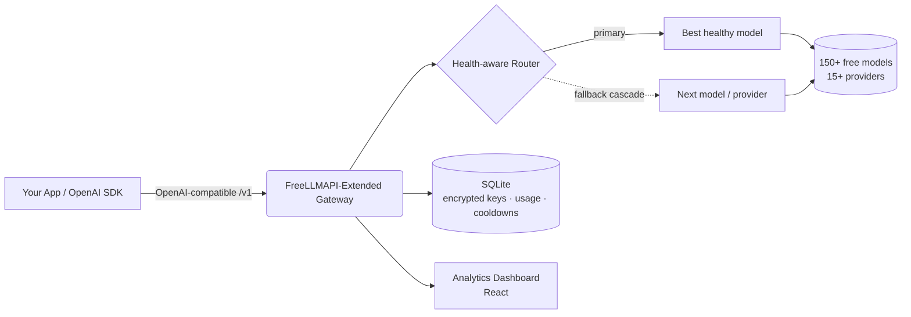

<div align="center">



# FreeLLMAPI-Extended

### 一个 OpenAI 兼容端点，统一接入 150+ 免费大语言模型 —— 具备健康感知路由、自动故障转移与完整的分析仪表盘。

**自托管、开源的 LLM 网关与聚合器。** 通过单一 OpenAI 兼容 API，将聊天、视觉、图像生成、嵌入向量、音频（STT/TTS）和重排序请求路由到 15+ 免费提供商 —— 内置智能故障转移，即使某个提供商触发速率限制，你的应用也永不宕机。

[](LICENSE)
[](https://www.typescriptlang.org/)
[](#-api-usage)
[](#-supported-providers)
[](#-supported-providers)
[](#-features)

**🌍 Read this in your language:**
[English](README.md) ·
[Türkçe](README.tr.md) ·
[中文](README.zh.md) ·
[日本語](README.ja.md) ·
[한국어](README.ko.md) ·
[Español](README.es.md) ·
[Português](README.pt.md) ·
[Русский](README.ru.md)

</div>

---

## 📖 什么是 FreeLLMAPI-Extended？

**FreeLLMAPI-Extended 是一个免费、自托管的 LLM API 网关。** 它对外暴露单一 OpenAI 兼容的 REST 端点，并将每个请求透明地路由到 15+ 提供商中当前可用的最佳免费模型（Google Gemini、Groq、Cerebras、Cloudflare Workers AI、Mistral、OpenRouter、GitHub Models、Cohere、SambaNova、NVIDIA NIM、Z.ai 等等）。

当某个提供商触发速率限制、报错或宕机时，网关会**自动级联切换到下一个健康的模型** —— 你的应用无需改动任何代码即可继续运行。只需将任意 OpenAI SDK 指向你的网关 URL，即可立即获得免费、多提供商、容错的推理能力。

> OpenAI API 的即插即用替代方案。只改一个 base URL —— 保留你现有的代码。

---

## ✨ 功能特性

| 能力 | 你将获得什么 |
|---|---|
| 🔌 **OpenAI 兼容** | `/v1/chat/completions`、`/v1/embeddings`、`/v1/images/generations`、`/v1/audio/{speech,transcriptions}`、`/v1/rerank`、`/v1/batches`。无需修改即可配合官方 OpenAI Python/Node SDK 使用。 |
| 🧠 **健康感知自动路由** | 模型按**实测**成功率 + 延迟排序（而非仅凭静态规格），因此最快且可靠的模型排在前面。失效或缓慢的模型会自动下沉。 |
| 🔁 **自动故障转移级联** | 跨模型与提供商的逐请求故障转移，配合自适应冷却（分钟级 / 天级 / 死路由分类）。单个提供商宕机绝不会让请求失败。 |
| 👁️ **视觉（多模态）** | 在提示中附带图像。视觉感知路由会自动选择支持视觉的模型。 |
| 🎨 **图像生成与编辑** | 文生图、图生图、局部重绘（inpainting）、扩图（outpainting）（FLUX、SDXL、CogView、Pollinations 等等）。 |
| 🔢 **嵌入向量与重排序** | 多提供商嵌入（BGE-M3、Gemini、Cohere、Mistral）+ Cohere 重排序，适用于 RAG 流水线。 |
| 🔊 **音频** | 语音转文字（Whisper）与文字转语音，统一在一个 API 中。 |
| 📦 **Batch API** | OpenAI 风格的异步批处理，支持 Webhook（HMAC 签名）、重试与 NDJSON 结果。 |
| 🧩 **结构化输出与工具** | JSON 模式、JSON Schema、函数/工具调用以及流式传输（SSE）。 |
| 🗝️ **免密钥提供商** | 部分提供商（Pollinations、Kilo）**完全无需 API 密钥**即可使用 —— 开箱即用的免费溢出容量。 |
| 👥 **按项目密钥 + 支出控制** | 为每个项目签发命名 API 密钥，按密钥追踪用量，并对每个终端用户实施每日/每周/每月支出限额。 |
| 📊 **分析仪表盘** | 实时请求量、成功率、延迟、Token 用量、成本估算、级联重试次数以及按密钥的细分统计。 |
| 🔐 **加密密钥存储** | 提供商密钥以 AES-256-GCM 静态加密存储。 |
| 🤖 **模型别名** | 固定、不受重排序影响的链路（例如为编码代理设置 `coding` 别名），实现确定性路由。 |
| 🩺 **每日健康探测** | 定时任务会探测每个模型并比对上游目录的差异，从而在用户遇到失效模型之前就提前发现。 |
| 🧰 **内置 MCP 服务器** | 内置 Model Context Protocol 服务器，让 MCP 客户端可以直接使用该网关。 |

**6 种模态 · 15+ 提供商 · 150+ 免费模型 · 1 个端点。**

---

## 🏗️ 架构



- **后端：** Node.js + TypeScript + Express，`better-sqlite3`（无需外部数据库）。
- **前端：** React 编写的分析与密钥管理仪表盘。
- **存储：** SQLite —— 提供商密钥以 AES-256-GCM 加密。
- **路由：** 逐请求级联，配合持久化、分类的冷却（重启后依然有效）。

---

## 🚀 快速开始

```bash
# 1. Clone
git clone https://github.com/SeyhmusKaya/freellmapi-extended.git
cd freellmapi-extended

# 2. Install
npm install

# 3. Configure
cp .env.example .env
# Generate an encryption key:
node -e "console.log(require('crypto').randomBytes(32).toString('hex'))"
# Paste it into .env as ENCRYPTION_KEY=...

# 4. Run (server + dashboard)
npm run dev
```

打开仪表盘，添加一个免费提供商密钥（或使用免密钥提供商），即可立即上线。所有配置选项详见 [`.env.example`](.env.example)。

---

## 🔌 API 使用

将**任意** OpenAI SDK 指向你的网关。将 `model` 字段留空即可自动路由到当前可用的最佳模型。

### Python（OpenAI SDK）

```python
from openai import OpenAI

client = OpenAI(
    base_url="http://localhost:3001/v1",   # your gateway
    api_key="YOUR_GATEWAY_KEY",
)

resp = client.chat.completions.create(
    model="",  # empty = auto-route across all free providers
    messages=[{"role": "user", "content": "Explain quantum computing in one sentence."}],
)
print(resp.choices[0].message.content)
```

### cURL

```bash
curl http://localhost:3001/v1/chat/completions \
  -H "Authorization: Bearer YOUR_GATEWAY_KEY" \
  -H "Content-Type: application/json" \
  -d '{"messages":[{"role":"user","content":"Hello!"}]}'
```

### 视觉（图像 + 文本）

```json
{
  "messages": [{
    "role": "user",
    "content": [
      {"type": "text", "text": "What is in this image?"},
      {"type": "image_url", "image_url": {"url": "data:image/jpeg;base64,..."}}
    ]
  }]
}
```

响应头会暴露路由决策：`X-Routed-Via: groq/llama-4-scout` 与 `X-Fallback-Attempts: 0`。

---

## 🧠 智能路由

FreeLLMAPI-Extended 与简单代理的区别在于：

- **实测健康，而非猜测。** 故障转移链路会根据每个模型真实的 7 天成功率与延迟持续重新排序。开始失败的模型会自动下沉；快速可靠的模型会上升。
- **分类冷却。** 错误会被归类（分钟级速率限制、天级配额、死路由、无效密钥），每一类都会获得恰当的冷却时长 —— 天级配额会等待到 UTC 午夜，而瞬时突发只需等待几秒。
- **全场景级联。** 404 / 429 / 5xx / 超时 / 提供商特有的 400 都会触发跳过并继续切换到下一个模型，因此单个古怪的端点绝不会拖垮整个请求。
- **免密钥溢出。** 匿名提供商充当最后兜底容量，即使所有需要密钥的提供商都触发速率限制，你仍能继续提供服务。
- **按终端用户支出限额。** 将成本归因到你自己的终端用户，并对每日/每周/每月支出设置上限。

---

## 🌐 支持的提供商

文本聊天、视觉、图像生成、嵌入向量、音频（STT/TTS）和重排序，覆盖：

**Google Gemini · Groq · Cerebras · Cloudflare Workers AI · Mistral · OpenRouter · GitHub Models · Cohere · SambaNova · NVIDIA NIM · Z.ai (Zhipu) · Pollinations（免密钥）· Kilo Gateway（免密钥）· AI21 · Reka** —— 并提供便捷途径接入任意 OpenAI 兼容提供商。

> 免费层限额、模型清单和各提供商说明详见 [`docs/FREE-PROVIDERS-RESEARCH.md`](docs/FREE-PROVIDERS-RESEARCH.md)。

---

## 📊 仪表盘

内置的 React 仪表盘，用于密钥、路由与分析：

- **分析（Analytics）** —— 请求量、真实成功率、延迟、Token 用量、成本估算、级联重试次数、按 API 密钥的细分统计。
- **密钥（Keys）** —— 添加/轮换/禁用提供商密钥（静态加密），并签发按项目的消费者密钥。
- **故障转移（Fallback）** —— 查看并重新排序路由链路，或按实测质量排序。
- **演练场（Playground）** —— 直接在浏览器中测试模型。

<!-- Screenshots: place dashboard images in /repo-assets and reference them here. -->
<!--  -->

---

## 📚 文档

| 文档 | 说明 |
|---|---|
| [`docs/FREE-PROVIDERS-RESEARCH.md`](docs/FREE-PROVIDERS-RESEARCH.md) | 完整的提供商/模型矩阵、免费层限额、更新日志 |
| [`docs/BATCH-API.md`](docs/BATCH-API.md) | 异步 Batch API 使用指南 |
| [`docs/IMAGE-GEN-PLAN.md`](docs/IMAGE-GEN-PLAN.md) | 图像生成与编辑 |
| [`docs/VISION-PLAN.md`](docs/VISION-PLAN.md) | 视觉 / 多模态 |
| [`docs/STRUCTURED-OUTPUT-PLAN.md`](docs/STRUCTURED-OUTPUT-PLAN.md) | JSON 模式与结构化输出 |
| [`mcp/README.md`](mcp/README.md) | Model Context Protocol 服务器 |

---

## ❓ 常见问题

**它真的免费吗？**
是的 —— 它聚合了众多提供商的免费层。你提供免费的 API 密钥（或使用免密钥提供商）。网关本身采用 MIT 许可证并可自托管。

**它兼容 OpenAI 吗？**
是的。它实现了 OpenAI 的 Chat Completions、Embeddings、Images、Audio 和 Batch 接口形态。大多数应用只需更改 base URL。

**当某个提供商触发速率限制或宕机时会发生什么？**
请求会自动级联到下一个健康的模型/提供商。调用方永远看不到失败 —— 只会看到略有不同的 `X-Routed-Via` 响应头。

**我需要一个数据库服务器吗？**
不需要。它使用嵌入式 SQLite（`better-sqlite3`）。提供商密钥以 AES-256-GCM 加密。

**我可以添加自己的提供商吗？**
可以 —— 任意 OpenAI 兼容端点都可以通过 base URL 注册接入。

**它和普通代理有什么不同？**
健康感知的重新排序、分类的自适应冷却、逐请求级联、免密钥溢出、批处理、按终端用户支出限额，以及完整的分析仪表盘。

---

## 🙏 致谢与署名

FreeLLMAPI-Extended 构建于并受启发于
**[tashfeenahmed/freellmapi](https://github.com/tashfeenahmed/freellmapi)**（作者 [@tashfeenahmed](https://github.com/tashfeenahmed)）这一出色的开源工作 —— 衷心感谢其奠定的原始基础。本项目在此基础上扩展了更多模态、健康感知路由、批处理、按终端用户计费、免密钥提供商，以及重新设计的分析仪表盘。

采用 **MIT** 许可证（与上游相同）—— 详见 [LICENSE](LICENSE)。

---

## 🤝 参与贡献

欢迎提交 Issue 和 Pull Request。无论是新的免费提供商、路由改进、缺陷修复还是文档完善 —— 任何规模的贡献都有帮助。

---

<div align="center">

**FreeLLMAPI-Extended** —— 免费的 OpenAI 兼容 LLM 网关 · 多提供商 AI API 聚合器 · 自带自动故障转移的自托管 LLM 路由器。

⭐ 如果本项目对你有帮助，请点亮 Star 以支持后续开发。

<sub>关键词：免费 LLM API、OpenAI 兼容网关、LLM 聚合器、多提供商 AI 路由器、免费 GPT API 替代方案、自托管 AI 网关、LLM 故障转移、Gemini Groq Cerebras Cloudflare 免费 API、AI 代理、免费嵌入向量 API、免费图像生成 API。</sub>

</div>
